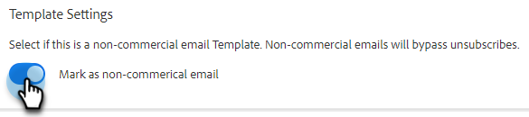

# Plantillas de correo electrónico de ventas transaccionales {#transactional-sales-email-templates}

Si su equipo envía correos electrónicos transaccionales o no comerciales, puede marcar una plantilla de correo electrónico como no comercial para que pueda evitar las cancelaciones de suscripción.

## Cosas que hay que tener en cuenta {#things-to-note}

* Los correos electrónicos no comerciales evitarán las cancelaciones de suscripción de ventas y la [comprobación de cancelación de suscripción de Marketo Engage](/help/marketo/product-docs/marketo-sales-connect/email/unsubscribes/marketo-unsubscribe-check.md){target="_blank"}, pero no evitarán los [dominios bloqueados](/help/marketo/product-docs/marketo-sales-connect/admin/blocked-domains.md){target="_blank"}.

* Los mensajes de cancelación de suscripción no se adjuntarán automáticamente a los mensajes de correo electrónico no comerciales, aunque la configuración [anexar/cancelar la suscripción del administrador de mensajes](/help/marketo/product-docs/marketo-sales-connect/email/unsubscribes/auto-append-unsubscribe-message-setting.md){target="_blank"} esté habilitada. Sin embargo, el `{{team_unsubscribe}}` [campo dinámico](/help/marketo/product-docs/marketo-sales-connect/templates/dynamic-fields/dynamic-fields-glossary.md){target="_blank"} seguirá rellenando el mensaje de cancelación de suscripción del equipo.

## Configuración de una plantilla de correo electrónico para uso no comercial {#configure-an-email-template-for-non-commercial-use}

1. En el encabezado, haga clic en **Plantillas**.

   

1. Busque y seleccione la plantilla que desea actualizar.

   

1. Habilite la opción de correo electrónico no comercial en Configuración de plantilla.

   

## Enviar un correo electrónico no comercial {#send-a-non-commercial-email}

>[!NOTE]
>
>Cuando se selecciona una persona sin suscribir, aparece resaltada en naranja.

1. En el encabezado, haga clic en **Componer**. Busque y seleccione la plantilla no comercial que desee.

   

1. Los usuarios verán un banner que les mostrará que han seleccionado una plantilla de correo electrónico no comercial.

   

1. Haga clic en **Enviar**.

   

El correo electrónico se enviará incluso si la persona ha cancelado la suscripción.
