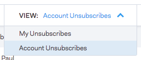

# Grupo de cancelación de suscripción {#unsubscribe-group}

Ver y administrar todas las personas que cancelaron su suscripción en un solo lugar.

Utilice la barra de búsqueda para buscar cualquier persona que no esté suscrita.

Si es administrador, puede ir al grupo Cancelar suscripción para filtrar por [!UICONTROL Cancelaciones de suscripción de cuenta] y ver todas las cancelaciones de suscripción que se han recopilado en su base de datos de personas.

