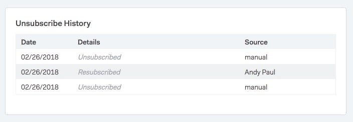

# Tarjeta de historial de cancelación de suscripción {#unsubscribe-history-card}

La tarjeta [!UICONTROL Cancelar la suscripción al historial] ayuda a los administradores y usuarios a obtener información contextual sobre el historial de cancelación de suscripción de sus contactos.

>[!NOTE]
>
>Para llegar aquí, haga clic en la ficha [!UICONTROL Personas] y seleccione una persona. Se encuentra en la parte inferior de la pestaña [!UICONTROL About] en la vista de detalles de la persona (si se ha cancelado la suscripción).

<table>
 <colgroup>
  <col>
  <col>
 </colgroup>
 <tbody>
  <tr>
   <td><strong>[!UICONTROL Fecha]</strong></td>
   <td>
Muestra la fecha en la que se canceló la suscripción o se volvió a suscribir.
</td>
  </tr>
  <tr>
   <td><strong>[!UICONTROL Detalles]</strong></td>
   <td>
Volver a suscribir: un administrador de [!DNL Sales Connect] quitó manualmente la cancelación de la suscripción del registro de contacto. También puede mostrar algunos detalles relacionados con el motivo por el que se canceló la suscripción al contacto.

Cancelar suscripción: se canceló la suscripción del contacto.
</td>
  </tr>
  <tr>
   <td><strong>[!UICONTROL Source]</strong></td>
   <td>
Sincronización de Salesforce: una sincronización de [!DNL Salesforce] capturó la cancelación de la suscripción.

Manual: el usuario ha hecho clic en el botón Cancelar la suscripción para darse de baja.

Vínculo en el que se hizo clic: el destinatario de un correo electrónico hizo clic en el vínculo para cancelar la suscripción.

"Nombre del administrador": Se mostrará un nombre de administrador cuando la acción fue volver a suscribir contactos. Esto permite a los usuarios saber quién eliminó la cancelación de la suscripción.
</td>
  </tr>
 </tbody>
</table>
