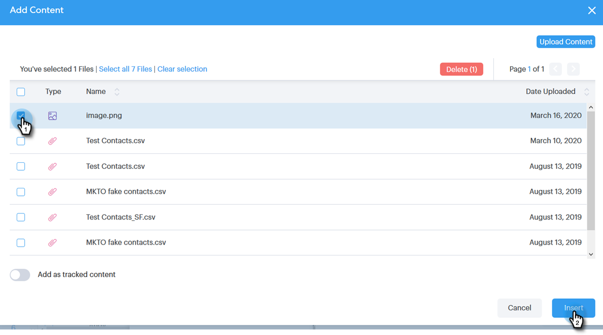

# Añadir un archivo adjunto o contenido rastreable a su correo electrónico {#add-an-attachment-or-trackable-content-to-your-email}

Al enviar un correo electrónico a través de [!DNL Sales Connect], tiene la opción de agregar un archivo como archivo adjunto o de hacer que un archivo sea un vínculo descargable (y rastreable).

>[!NOTE]
>
>Normalmente, cualquier archivo de más de 20 MB es demasiado grande para enviarlo. El tamaño de un archivo adjunto que puede enviar por correo electrónico varía según el canal de envío de correo electrónico que utilice.

## Añadir un archivo adjunto {#add-an-attachment}

1. Cree su borrador de correo electrónico (existen varias formas de hacerlo; en este ejemplo, elegimos **[!UICONTROL Componer]** en el encabezado).

   

1. Rellene el campo [!UICONTROL Para] e introduzca un [!UICONTROL Asunto].

   

1. Haga clic en el icono adjunto.

   

1. Seleccione el archivo que desea adjuntar y haga clic en **[!UICONTROL Insertar]**.

   

   >[!NOTE]
   >
   >Si necesita cargar un archivo, haga clic en el botón **Cargar contenido** en la parte superior derecha de la ventana.

   

El archivo adjunto aparece en la parte inferior del correo electrónico.

## Añadir contenido rastreable {#add-trackable-content}

1. Cree su borrador de correo electrónico (existen varias formas de hacerlo; en este ejemplo elegimos la ventana [!UICONTROL Componer]).

   

1. Rellene el campo [!UICONTROL Para] e introduzca un [!UICONTROL Asunto].

   

1. Haga clic en el lugar del correo electrónico en el que desea que aparezca el contenido rastreable y haga clic en el icono de archivo adjunto.

   

1. Seleccione el contenido que desea agregar, haga clic en el control deslizante **[!UICONTROL Se hace un seguimiento del contenido]** y, a continuación, haga clic en **[!UICONTROL Insertar]**.

   

   >[!NOTE]
   >
   >Si necesita cargar un archivo, haga clic en el botón **Cargar contenido** en la parte superior derecha de la ventana.

   El contenido aparece como un vínculo en el correo electrónico. El destinatario puede hacer clic en el vínculo para descargar el contenido.

   

   >[!NOTE]
   >
   >Se notificará a los usuarios en la fuente Live Feed cuando las personas estén viendo el contenido rastreado. Los usuarios también pueden ver el contenido de mayor rendimiento en la sección de contenido de la página de Analytics.
