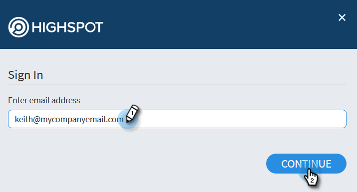
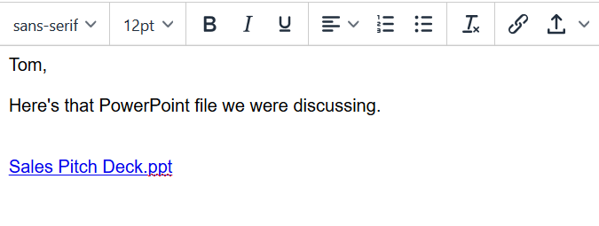

# Agregando contenido de [!DNL Highspot] al correo electrónico {#adding-highspot-content-to-your-email}

Si es cliente de [!DNL Highspot], puede insertar fácilmente contenido de [!DNL Highspot] en sus correos electrónicos de [!DNL Sales Connect].

1. Cree su borrador de correo electrónico (existen varias formas de hacerlo; en este ejemplo, elegimos **[!UICONTROL Componer]** en el encabezado).

   

1. Rellene el campo [!UICONTROL Para] e introduzca un [!UICONTROL Asunto].

   

1. Haga clic en el lugar del correo electrónico donde desee insertar el contenido de [!DNL Highspot]. Haga clic en la lista desplegable de flecha (junto al icono de datos adjuntos) y seleccione **[!UICONTROL Punto alto]**.

   

1. Inicie sesión en su cuenta de [!DNL Highspot].

   

1. Seleccione el contenido que desee y haga clic en el botón **[!UICONTROL Agregar contenido]**.

   

   >[!NOTE]
   >
   >Si no ve el contenido que desea que aparezca en la lista, utilice la barra de búsqueda situada en la parte superior.

   

El contenido aparece como un vínculo en el correo electrónico. El destinatario puede hacer clic en el vínculo para ver o descargar el contenido.
