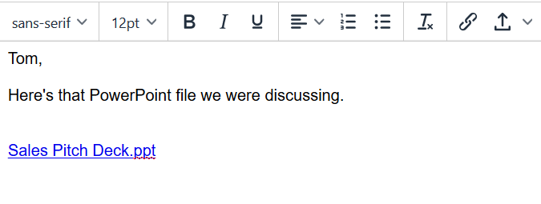

# Adición de contenido destacado al correo electrónico {#adding-highspot-content-to-your-email}

Si es cliente de Highspot, puede insertar fácilmente contenido de Highspot en sus correos electrónicos de Sales Connect.

1. Cree su borrador de correo electrónico (hay varias formas de hacerlo, en este ejemplo elegimos **Componer** en el encabezado).

   

1. Rellene el campo To e introduzca un Subject.

   

1. Haga clic en el punto del correo electrónico en el que desea insertar el contenido de puntos altos. Haga clic en la lista desplegable de flecha (junto al icono de datos adjuntos) y seleccione **Alta**.

   

1. Inicie sesión en su cuenta de Highspot.

   

1. Seleccione el contenido deseado y haga clic en el botón **Añadir contenido** botón.

   

   >[!NOTE]
   >
   >Si no ve el contenido que desea enumerar, utilice la barra de búsqueda situada en la parte superior.

   

El contenido aparece como un vínculo en el correo electrónico. El destinatario puede hacer clic en el vínculo para ver o descargar el contenido.
