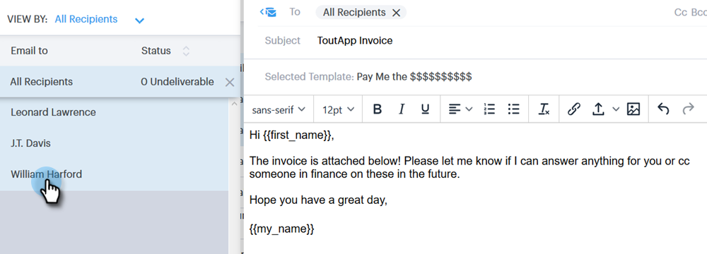

# Redacción de correos electrónicos masivos con Select y Send {#composing-bulk-emails-with-select-and-send}

A continuación se muestra cómo enviar/editar correos electrónicos mediante la opción Select and Send .

## Enviando emails {#sending-emails}

1. Vaya a la página Personas.

   

1. Seleccione las personas a las que desee enviar un correo electrónico.

   

   >[!NOTE]
   >
   >Se puede seleccionar un máximo de 200 personas al utilizar Seleccionar y Enviar.

1. Haga clic en el **Correo electrónico seleccionado** botón.

   

1. Introduzca una línea de asunto, seleccione una plantilla (o redacte el correo electrónico desde cero) y envíe/[programación](/help/marketo/product-docs/marketo-sales-connect/email/using-the-compose-window/scheduling-an-email.md) el correo electrónico.

   

   >[!NOTE]
   >
   >Si ha seleccionado una plantilla y desea comprobar que todos los campos dinámicos se rellenan correctamente antes de enviarla, haga clic en **Vista previa de campos dinámicos**. Asegúrese de que todos los destinatarios de la barra lateral masiva estén seleccionados para la vista previa de todos los correos electrónicos. Si selecciona un correo electrónico y hace clic en **Vista previa de campos dinámicos**, solo se previsualizará ese correo electrónico.

## Edición de correos electrónicos {#editing-emails}

**Ediciones masivas**

1. Siga los pasos del 1 al 3 desde [Sección Envío de correos electrónicos](#sending-emails).

   >[!NOTE]
   >
   >Todos los destinatarios se seleccionan de forma predeterminada. Si hace clic en un individuo y desea volver a seleccionar a todos, haga clic en **Todos los destinatarios**. Como recordatorio, se deben seleccionar todos los destinatarios para realizar ediciones masivas.

1. Realice los cambios en el editor. Puede crear un nuevo correo electrónico o editar una plantilla (en este ejemplo estamos creando un nuevo correo electrónico).

   

   >[!NOTE]
   >
   >Puede hacer clic en un destinatario de correo electrónico específico para ver los cambios propagados a ese correo electrónico.

1. Haga clic en **Enviar** (o [Programación](/help/marketo/product-docs/marketo-sales-connect/email/using-the-compose-window/scheduling-an-email.md)) para enviarlo a todos los destinatarios con las actualizaciones de correo electrónico masivas que haya realizado.

   

**Editar cada correo electrónico**

Completar actualizaciones masivas antes de personalizar cada correo electrónico, ya que al realizar una actualización masiva se sobrescriben los cambios realizados en cada correo electrónico de la barra lateral de composición masiva.

1. Siga los pasos 1-4 de la sección [Sección Envío de correos electrónicos](#sending-emails).

   >[!NOTE]
   >
   >Todos los destinatarios se seleccionan de forma predeterminada. Si hace clic en un individuo y desea volver a seleccionar a todos, haga clic en **Todos los destinatarios**. Como recordatorio, se deben seleccionar todos los destinatarios para realizar ediciones masivas.

1. Seleccione un destinatario individual.

   

1. Realice los cambios en el editor.

   

   >[!NOTE]
   >
   >Aquí es donde puede realizar modificaciones en un solo correo electrónico de la barra lateral masiva sin actualizar el resto de los correos electrónicos.

   >[!TIP]
   >
   >Puede hacer clic en otros destinatarios para ver que no se muestran los cambios realizados en el destinatario seleccionado anteriormente.

1. Haga clic en **Enviar** (o [Programación](/help/marketo/product-docs/marketo-sales-connect/email/using-the-compose-window/scheduling-an-email.md)) para enviarlo a todos los destinatarios con las actualizaciones de correo electrónico masivas que haya realizado.

   

   >[!MORELIKETHIS]
   >
   >* [Opciones de envío masivo](/help/marketo/product-docs/marketo-sales-connect/email/using-the-compose-window/bulk-sending-options.md)
   >* [Uso de una plantilla en la ventana de composición](/help/marketo/product-docs/marketo-sales-connect/email/using-the-compose-window/using-a-template-in-the-compose-window.md)
   >* [Campos dinámicos](/help/marketo/product-docs/marketo-sales-connect/templates/dynamic-fields/how-to-insert-dynamic-fields.md)

