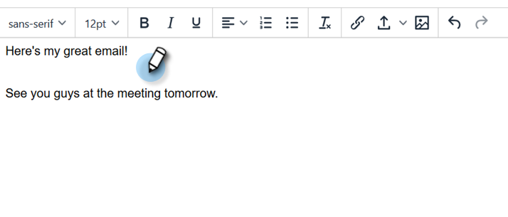
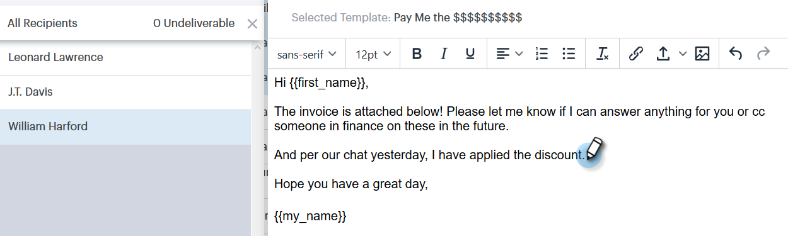

# Redacción de correos electrónicos masivos con Seleccionar y enviar {#composing-bulk-emails-with-select-and-send}

A continuación se muestra cómo enviar o editar correos electrónicos mediante la opción Seleccionar y enviar.

## Envío de correos electrónicos {#sending-emails}

1. Vaya a la página Personas.

   

1. Seleccione las personas a las que desee enviar un correo electrónico.

   

   >[!NOTE]
   >
   >Se puede seleccionar un máximo de 200 personas al utilizar Seleccionar y enviar.

1. Haga clic en el botón **Correo electrónico seleccionado**.

   

1. Introduzca una línea de asunto, seleccione una plantilla (o redacte el correo electrónico desde cero) y envíe/[programar](/help/marketo/product-docs/marketo-sales-connect/email/using-the-compose-window/scheduling-an-email.md) el correo electrónico.

   

   >[!NOTE]
   >
   >Si seleccionó una plantilla y desea comprobar que todos los campos dinámicos se rellenan correctamente antes de enviarla, haga clic en **Campos dinámicos de Previsualización**. Asegúrese de que todos los destinatarios de la barra lateral masiva estén seleccionados para la previsualización de todos los correos electrónicos. Si selecciona un mensaje de correo electrónico y hace clic en **Campos dinámicos de Previsualización**, solo se verá la vista previa de ese mensaje de correo electrónico.

## Edición de correos electrónicos {#editing-emails}

**Ediciones masivas**

1. Siga los pasos 1 a 3 de la sección [Envío de correos electrónicos](#sending-emails).

   >[!NOTE]
   >
   >Todos los destinatarios se seleccionarán de forma predeterminada. Si hace clic en un individuo y desea volver a seleccionar a todos, haga clic en **Todos los Destinatarios**. Como recordatorio, todos los destinatarios deben seleccionarse para realizar ediciones masivas.

1. Realice los cambios en el editor. Puede crear un nuevo mensaje de correo electrónico o editar una plantilla (en este ejemplo estamos creando un nuevo mensaje de correo electrónico).

   

   >[!NOTE]
   >
   >Puede hacer clic en un destinatario de correo electrónico específico para ver los cambios propagados a ese correo electrónico.

1. Haga clic en **Enviar** (o [Programar](/help/marketo/product-docs/marketo-sales-connect/email/using-the-compose-window/scheduling-an-email.md)) para enviar a todos los destinatarios las actualizaciones masivas de correo electrónico que realizó.

   

**Editar cada correo electrónico**

Complete las actualizaciones masivas antes de personalizar cada correo electrónico, ya que al realizar una actualización masiva se sobrescriben los cambios realizados en cada correo electrónico de la barra lateral de composición masiva.

1. Siga los pasos 1 a 4 de la sección [Envío de correos electrónicos](#sending-emails).

   >[!NOTE]
   >
   >Todos los destinatarios se seleccionarán de forma predeterminada. Si hace clic en un individuo y desea volver a seleccionar a todos, haga clic en **Todos los Destinatarios**. Como recordatorio, todos los destinatarios deben seleccionarse para realizar ediciones masivas.

1. Seleccione un destinatario individual.

   

1. Realice los cambios en el editor.

   

   >[!NOTE]
   >
   >Aquí puede realizar modificaciones en un solo correo electrónico de la barra lateral masiva sin actualizar el resto de los correos electrónicos.

   >[!TIP]
   >
   >Puede hacer clic en otros destinatarios para ver que no se muestran los cambios realizados en el destinatario seleccionado anteriormente.

1. Haga clic en **Enviar** (o [Programar](/help/marketo/product-docs/marketo-sales-connect/email/using-the-compose-window/scheduling-an-email.md)) para enviar a todos los destinatarios las actualizaciones masivas de correo electrónico que realizó.

   

   >[!MORELIKETHIS]
   >
   >* [Opciones de envío masivo](/help/marketo/product-docs/marketo-sales-connect/email/using-the-compose-window/bulk-sending-options.md)
   >* [Uso de una plantilla en la ventana Redacción](/help/marketo/product-docs/marketo-sales-connect/email/using-the-compose-window/using-a-template-in-the-compose-window.md)
   >* [Campos dinámicos](/help/marketo/product-docs/marketo-sales-connect/templates/dynamic-fields/how-to-insert-dynamic-fields.md)

