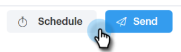

# Redacción de correos electrónicos masivos con selección y envío {#composing-bulk-emails-with-select-and-send}

A continuación, se muestra cómo enviar/editar correos electrónicos con la opción Seleccionar y enviar.

## Enviando emails {#sending-emails}

1. Vaya a la página Personas.

   

1. Seleccione las personas a las que desee enviar un correo electrónico.

   

   >[!NOTE]
   >
   >Se puede seleccionar un máximo de 200 personas al utilizar Seleccionar y enviar.

1. Haga clic en el botón **Correo electrónico seleccionado**.

   

1. Escribe una línea de asunto, selecciona una plantilla (o redacta el correo electrónico desde cero) y envía/[programar](/help/marketo/product-docs/marketo-sales-connect/email/using-the-compose-window/scheduling-an-email.md) el correo electrónico.

   

   >[!NOTE]
   >
   >Si seleccionó una plantilla y desea comprobar que todos los campos dinámicos se rellenan correctamente antes de enviarla, haga clic en **Vista previa de los campos dinámicos**. Asegúrese de que todos los destinatarios de la barra lateral por lotes estén seleccionados para previsualizar todos los correos electrónicos. Si selecciona un correo electrónico y hace clic en **Vista previa de campos dinámicos**, solo se previsualizará ese correo electrónico.

## Edición de correos electrónicos {#editing-emails}

**Ediciones masivas**

1. Siga los pasos del 1 al 3 de la sección [Envío de correos electrónicos](#sending-emails).

   >[!NOTE]
   >
   >Todos los destinatarios se seleccionan de forma predeterminada. Si hace clic en un individuo y desea volver a seleccionar a todos, haga clic en **Todos los destinatarios**. Como recordatorio, todos los destinatarios deben estar seleccionados para realizar ediciones masivas.

1. Realice los cambios en el editor. Puede crear un correo electrónico nuevo o editar una plantilla (en este ejemplo creamos un correo electrónico nuevo).

   

   >[!NOTE]
   >
   >Puede hacer clic en un destinatario de correo electrónico específico para ver los cambios propagados a ese correo electrónico.

1. Haga clic en **Enviar** (o [Programar](/help/marketo/product-docs/marketo-sales-connect/email/using-the-compose-window/scheduling-an-email.md)) para enviar a todos los destinatarios con las actualizaciones masivas de correo electrónico que haya realizado.

   

**Editar cada correo electrónico**

Complete las Actualizaciones masivas antes de personalizar cada correo electrónico, ya que al realizar una actualización masiva se sobrescriben los cambios realizados en cada correo electrónico en la barra lateral de composición masiva.

1. Siga los pasos del 1 al 4 de la sección [Envío de correos electrónicos](#sending-emails).

   >[!NOTE]
   >
   >Todos los destinatarios se seleccionan de forma predeterminada. Si hace clic en un individuo y desea volver a seleccionar a todos, haga clic en **Todos los destinatarios**. Como recordatorio, todos los destinatarios deben estar seleccionados para realizar ediciones masivas.

1. Seleccione un destinatario individual.

   

1. Realice los cambios en el editor.

   

   >[!NOTE]
   >
   >Aquí es donde puede realizar ediciones en un único correo electrónico en la barra lateral masiva sin actualizar el resto de los correos electrónicos.

   >[!TIP]
   >
   >Puede hacer clic en otros destinatarios para ver que no se muestran los cambios realizados en el destinatario seleccionado anteriormente.

1. Haga clic en **Enviar** (o [Programar](/help/marketo/product-docs/marketo-sales-connect/email/using-the-compose-window/scheduling-an-email.md)) para enviar a todos los destinatarios con las actualizaciones masivas de correo electrónico que haya realizado.

   

   >[!MORELIKETHIS]
   >
   >* [Opciones de envío masivo](/help/marketo/product-docs/marketo-sales-connect/email/using-the-compose-window/bulk-sending-options.md)
   >* [Uso de una plantilla en la ventana de composición](/help/marketo/product-docs/marketo-sales-connect/email/using-the-compose-window/using-a-template-in-the-compose-window.md)
   >* [Campos dinámicos](/help/marketo/product-docs/marketo-sales-connect/templates/dynamic-fields/how-to-insert-dynamic-fields.md)
