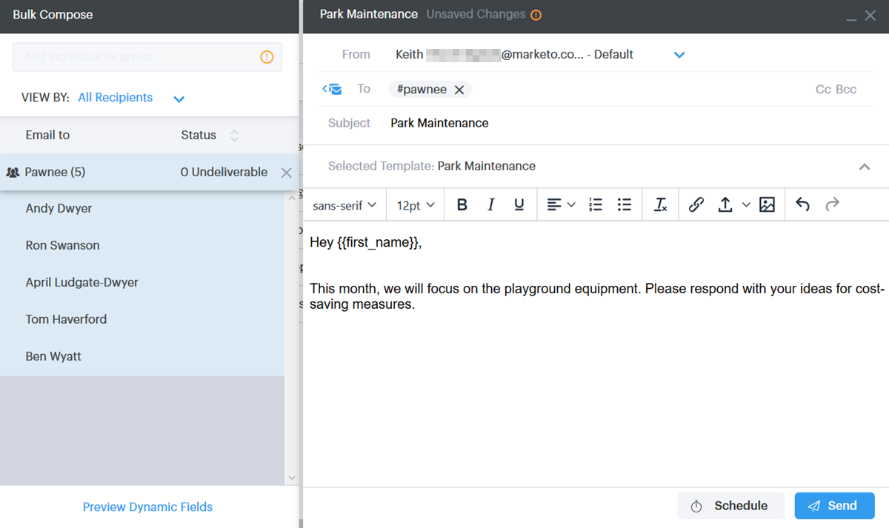

# Envío de correos electrónicos a través del correo electrónico del grupo {#sending-emails-via-group-email}

A continuación se muestra cómo enviar o editar correos electrónicos mediante la opción Agrupar correo electrónico.

## Envío de un mensaje de correo electrónico de grupo {#sending-a-group-email}

1. Haga clic en la ficha **Personas**.

   

1. Seleccione el grupo que desee enviar por correo electrónico.

   

1. Haga clic en el botón Acciones de grupo y seleccione **Grupo de correo electrónico**.

   

1. Rellene el correo electrónico (o seleccione una plantilla) y envíelo (o programe).

   

## Edición de un correo electrónico de grupo {#editing-a-group-email}

1. Cree un correo electrónico de grupo con los [pasos 1 a 3 anteriores](#sending-a-group-email).

1. Elija una plantilla o rellene el correo electrónico.

   

1. Con el correo electrónico terminado, ahora puede previsualización cada correo electrónico de la lista para ver si los campos dinámicos se rellenan correctamente.

   

1. Seleccione el destinatario que desee.

   

1. Haga clic en **Campos dinámicos de Previsualización** y vista la previsualización a la derecha.

   

   >[!NOTE]
   >
   >Puede realizar ediciones masivas en el correo electrónico o la plantilla al enviar un correo electrónico de grupo, pero no puede realizar ediciones únicas para destinatarios específicos de la lista.

>[!MORELIKETHIS]
>
>* [Opciones de envío masivo](/help/marketo/product-docs/marketo-sales-connect/email/using-the-compose-window/bulk-sending-options.md)
>* [Uso de una plantilla en la ventana Redacción](/help/marketo/product-docs/marketo-sales-connect/email/using-the-compose-window/using-a-template-in-the-compose-window.md)

