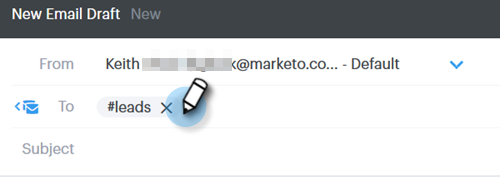

# Uso de una plantilla en la ventana Componer {#using-a-template-in-the-compose-window}

## Búsqueda y uso de plantillas {#finding-and-using-templates}

1. Cree su borrador de correo electrónico (hay varias formas de hacerlo, en este ejemplo elegimos **Componer** en el encabezado).

   

1. Rellene el campo Para.

   

1. Haga clic en el icono de búsqueda en la sección de plantilla para abrir el campo de búsqueda de plantilla.

   

1. Seleccione una categoría en la que buscar (o seleccione Todo para buscar en todas las categorías).

   

1. Busque por nombre de plantilla, línea de asunto o cuerpo del correo electrónico. Haga clic en la plantilla que desee para seleccionarla.

   

   >[!NOTE]
   >
   >Al seleccionar otra plantilla se reemplazará toda la información que se encuentra en el editor. Si realiza cambios, asegúrese de copiarlos antes de seleccionar otra plantilla.

## Fijar Categorías de plantilla en la ventana Componer {#pinning-template-categories-in-the-compose-window}

Favoritos **hasta cinco** categorías de plantilla específicas para obtener acceso rápido a las plantillas más utilizadas.

1. Cree su borrador de correo electrónico (hay varias formas de hacerlo, en este ejemplo elegimos **Componer** en el encabezado).

   

1. Haga clic en el icono **+** junto a Favoritos.

   

1. Haga clic en la lista desplegable **Fijar una Categoría** y seleccione la categoría que desee.

   

1. Haga clic en **Guardar cambios** cuando termine (opcional: repita el paso 3 para agregar más).

   

   >[!TIP]
   >
   >Puede reorganizar las categorías fijadas simplemente arrastrando y soltando antes de guardar los cambios.

   

   >[!NOTE]
   >
   >**** Favoritesis allí de forma predeterminada. Contiene plantillas de correo electrónico favoritas, no categorías.

   La categoría seleccionada está ahora anclada.
