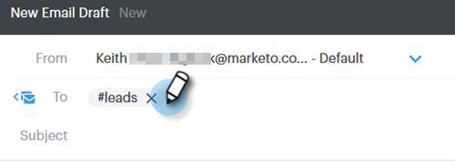
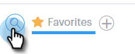
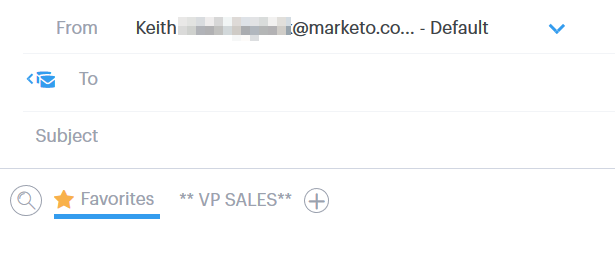

# Usar una plantilla en la ventana de composición {#using-a-template-in-the-compose-window}

## Búsqueda y uso de plantillas {#finding-and-using-templates}

1. Cree su borrador de correo electrónico (existen varias formas de hacerlo; en este ejemplo, elegimos **[!UICONTROL Componer]** en el encabezado).

   

1. Rellene el campo [!UICONTROL Para].

   

1. Haga clic en el icono de búsqueda en la sección de la plantilla para abrir el campo de búsqueda de la plantilla.

   

1. Seleccione una categoría para buscar (o seleccione Todo para buscar en todas las categorías).

   

1. Busque por nombre de plantilla, línea de asunto o cuerpo del correo electrónico. Haga clic en la plantilla deseada para seleccionarla.

   

   >[!NOTE]
   >
   >Si se selecciona otra plantilla, se reemplazará toda la información que se encuentra actualmente en el editor. Si realiza cambios, asegúrese de copiarlos antes de seleccionar otra plantilla.

## Fijar categorías de plantilla en la ventana de composición {#pinning-template-categories-in-the-compose-window}

**favorita hasta cinco** categorías de plantilla específicas para obtener acceso rápido a las plantillas más utilizadas.

1. Cree su borrador de correo electrónico (existen varias formas de hacerlo; en este ejemplo, elegimos **[!UICONTROL Componer]** en el encabezado).

   

1. Haga clic en el icono **+** junto a [!UICONTROL Favoritos].

   

1. Haga clic en el menú desplegable **[!UICONTROL Anclar una categoría]** y seleccione la categoría que desee.

   

1. Haga clic en **[!UICONTROL Guardar cambios]** cuando haya terminado (opcional: repita el paso 3 para agregar más).

   

   >[!TIP]
   >
   >Puede reorganizar las categorías ancladas simplemente arrastrando y soltando antes de guardar los cambios.

   

   >[!NOTE]
   >
   >**[!UICONTROL Favoritos]** está ahí de manera predeterminada. Contiene plantillas de correo electrónico favoritas, no categorías.

   La categoría seleccionada está anclada.
