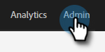
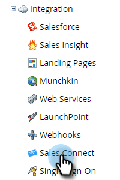

# Acceso a la nueva instancia de Sales Connect {#accessing-your-new-sales-connect-instance}

>[!NOTE]
>
>Se requieren **permisos de administración.**

Una vez adquirido Sales Connect, aparecerá una nueva página de integración en la instancia de Marketo. Utilice esta página para invitar a su primer usuario y aprovisionar su instancia de Sales Connect.

1. En Marketo, haga clic en **[!UICONTROL Administrador]**.

   

1. Haga clic en **[!UICONTROL Conexión de ventas]**.

   

1. Seleccione de una lista de administradores de Marketo para invitar y haga clic en **[!UICONTROL Enviar invitación]**.

   

El usuario recibirá un correo electrónico con los pasos para obtener acceso a la cuenta de Sales Connect.

>[!NOTE]
>
>Se agregarán **no** usuarios adicionales a través de Marketo y, en su lugar, se agregarán a través de la página Administración de usuarios de Sales Connect. [Haga clic aquí](/help/marketo/product-docs/marketo-sales-connect/admin/invite-users.md) para obtener más información sobre cómo agregar usuarios adicionales.
