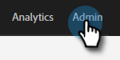

# Acceso a la nueva instancia de conexión de ventas {#accessing-your-new-sales-connect-instance}

>[!NOTE]
>
>**Se requieren permisos de administrador.**

Una vez que se haya comprado Sales Connect, aparecerá una nueva página de integración en la instancia de Marketo. Utilice esta página para invitar al primer usuario y aprovisionar su instancia de Conexión de ventas.

1. En Marketo, haga clic en **Admin**.

   

1. Haga clic en **Conexión de ventas**.

   

1. Seleccione entre una lista de administradores de Marketo para invitar y haga clic en **Enviar invitación**.

   

El usuario recibirá un correo electrónico con los pasos para obtener acceso a la cuenta de Conexión de ventas.

>[!NOTE]
>
>Los usuarios adicionales **no** se agregarán a través de Marketo y, en su lugar, se agregarán a través de la página Administración de usuarios de Sales Connect. [Haga clic ](/help/marketo/product-docs/marketo-sales-connect/admin/invite-users.md) aquí para obtener más información sobre cómo agregar usuarios adicionales.
