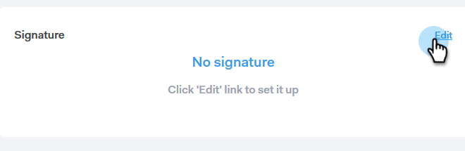
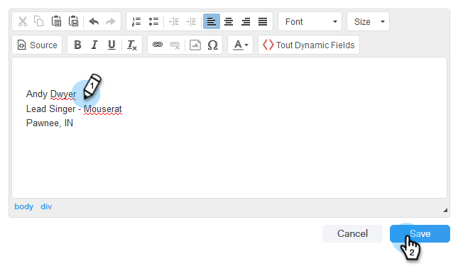

# Añadir su firma de correo electrónico {#add-your-email-signature}

Queremos que el correo electrónico de Sales Connect se sienta como una experiencia perfecta cuando envíe desde su propio cliente de correo electrónico. Una buena manera de hacerlo es añadir su firma de correo electrónico.

1. Haga clic en el icono del engranaje y seleccione **Configuración**.

   

1. En Mi cuenta, seleccione **Configuración de correo electrónico**.

   

1. Clic **Dirección y firma** y seleccione la identidad de correo electrónico para la que desee crear una firma.

   

1. En la tarjeta Firma, haga clic en **Editar**.

   

1. Introduzca el texto (o imágenes) que desee y haga clic en **Guardar**.

   

   >[!TIP]
   >
   >Asegúrese de que la firma de la pantalla de redacción sea similar a la que aparece en su cliente de correo electrónico.
