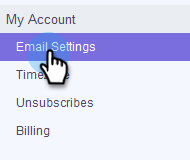

# Añadir su firma de correo electrónico {#add-your-email-signature}

Queremos que el correo electrónico de Sales Connect se sienta como una experiencia perfecta cuando envíe desde su propio cliente de correo electrónico. Una buena manera de hacerlo es agregar su firma de correo electrónico.

1. Haga clic en el icono del engranaje y seleccione **[!UICONTROL Configuración]**.

   

1. En [!UICONTROL Mi cuenta], seleccione **[!UICONTROL Configuración de correo electrónico]**.

   

1. Haga clic en **[!UICONTROL Dirección y firma]** y seleccione la identidad de correo electrónico para la que desee crear una firma.

   

1. En la tarjeta [!UICONTROL Firma], haga clic en **[!UICONTROL Editar]**.

   

1. Escriba el texto (o imágenes) que desee y haga clic en **[!UICONTROL Guardar]**.

   

   >[!TIP]
   >
   >Asegúrese de que la firma de la pantalla de redacción sea similar a la que aparece en su cliente de correo electrónico.
