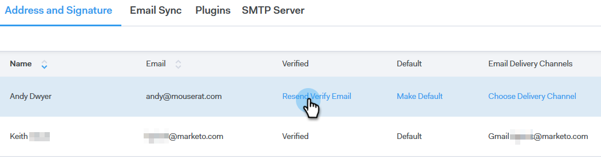

# Verifique su correo electrónico {#verify-your-email}

Si tiene una identidad de correo electrónico no verificada, siga los pasos a continuación.

1. Haga clic en el icono del engranaje en la parte superior derecha y elija **[!UICONTROL Configuración]**.

   

1. En [!UICONTROL Mi cuenta], haga clic en **[!UICONTROL Configuración de correo electrónico]**.

   

1. En [!UICONTROL Dirección y firma], busque la identidad del correo electrónico que desea verificar y haga clic en **[!UICONTROL Reenviar correo electrónico de verificación]**. Se enviará un nuevo correo electrónico de verificación.

   

1. Haga clic en **[!UICONTROL Reenviar]**.

   

1. A continuación, el destinatario abre el correo electrónico y sigue los pasos para verificar la identidad del correo electrónico.

   
