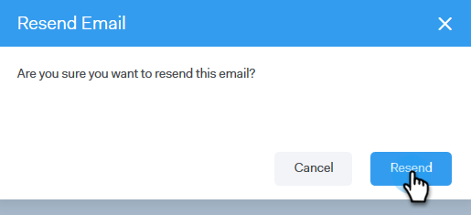

# Verifique su correo electrónico {#verify-your-email}

Si tiene una identidad de correo electrónico no verificada, siga los pasos a continuación.

1. Haga clic en el icono de engranaje en la parte superior derecha y elija **Configuración**.

   

1. En Mi cuenta, haga clic en Configuración **de correo electrónico**.

   

1. En Dirección y firma, busque la identidad de correo electrónico que desea verificar y haga clic en **Volver a enviar verificación de correo electrónico**. Se enviará un nuevo correo electrónico de verificación.

   

1. Haga clic en **Volver a enviar**.

   

1. A continuación, el destinatario abre el correo electrónico y sigue los pasos para comprobar la identidad del mismo.

   
