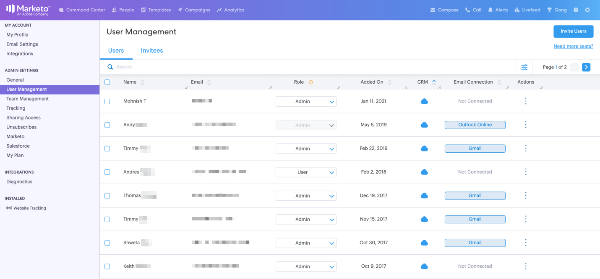

# Guía de introducción para los administradores de Sales Connect {#getting-started-guide-for-sales-connect-admins}

Este documento le llevará a través de los pasos iniciales para configurar su nueva instancia de Conexión de Ventas. Algunos de estos pasos requerirán acceso como administrador de Marketo, administrador de Salesforce y administrador de Sales Connect. Siga nuestras guías a continuación para completar la configuración de su instancia.

>[!NOTE]
>
>**Se requieren permisos de administrador.**

## Acceso a su nueva cuenta de conexión de ventas de Marketo {#accessing-your-new-marketo-sales-connect-account}

Si ha comprado Marketo Sales Connect, el acceso a su instancia se proporcionará en la sección de administración de Marketo. [Haga clic ](/help/marketo/product-docs/marketo-sales-connect/getting-started/accessing-your-new-sales-connect-instance.md) aquí para ver instrucciones sobre cómo un administrador de Marketo puede proporcionar acceso a su nueva instancia.

## Invitación y administración de usuarios {#inviting-and-managing-users}

Una vez que haya aprovisionado su cuenta de Marketo Sales Connect desde Marketo e invitado a su primer usuario administrador, ese usuario administrador puede invitar a usuarios adicionales desde la página de administración de usuarios de Marketo Sales Connect. [Haga clic ](/help/marketo/product-docs/marketo-sales-connect/admin/invite-users.md) aquí para ver cómo invitar a usuarios desde la página de administración de usuarios.

## Conexión a Salesforce {#connecting-to-salesforce}

Todos los usuarios deberán conectarse individualmente a Salesforce para habilitar las actividades de ventas de registro para la venta, como correos electrónicos, llamadas y tareas. Sin embargo, cuando se conecte a Salesforce como administrador, tendrá la oportunidad de configurar la configuración de registro de actividades para todo el equipo, de modo que la configuración de registro global se aplique a todos los usuarios de Sales Connect.

Para conectar la instancia de Conexión de ventas a la instancia de Salesforce, como administrador o no administrador, siga los pasos de [este artículo](/help/marketo/product-docs/marketo-sales-connect/crm/salesforce-integration/connect-your-sales-connect-account-to-salesforce.md).

## Conexión a Marketo {#connecting-to-marketo}

La conexión a Marketo permitirá a los vendedores aprovechar el poder de la automatización de marketing y las perspectivas de marketing en sus esfuerzos de prospección. Las siguientes funciones requieren que configure una integración con Marketo.

* Compartir [campañas de marketing](/help/marketo/product-docs/marketo-sales-connect/marketo/make-a-campaign-visible-to-sales-connect-users.md) con los vendedores
* Insertar [Momentos interesantes](/help/marketo/product-docs/marketo-sales-connect/marketo/interesting-moments-in-msc.md) en la fuente activa
* Registro de actividades de ventas en Marketo

Para obtener más información sobre cómo conectarse a Marketo y conceder acceso a la conexión a los usuarios de ventas, haga clic aquí.

## Instalación del paquete personalizado de Salesforce {#installing-salesforce-customization-package}

Parte de garantizar que las ventas estén habilitadas para el éxito significa tener las capacidades correctas en su espacio de trabajo principal. El paquete de personalización Conexión de ventas permite acceder a las funciones de participación y a los atributos clave de actividad de ventas desde Salesforce.

Para obtener más información sobre la instalación de la personalización de Sales Connect [haga clic aquí](/help/marketo/product-docs/marketo-sales-connect/crm/salesforce-customization/sales-connect-customizations-for-crm.md).

## Pruebas en Sandbox {#testing-in-sandbox}

Para los equipos que deseen probar Marketo Sales Connect con su Sandbox de Marketo, se puede aprovisionar una cuenta adicional de Sales Connect bajo petición. Esto solo es para clientes que han comprado un Simulador para pruebas de Marketo o que lo tienen como parte de su paquete de Marketo. Si está interesado en adquirir un Simulador para pruebas, póngase en contacto con su administrador de cuentas de Marketo.

>[!NOTE]
>
>No se puede aprovisionar una cuenta de Conexión de ventas con el mismo ID de correo electrónico para varias instancias. Esto significa que si desea tener una cuenta adicional de conexión de ventas para probarla con la instancia de Marketo Sandbox, deberá utilizar un ID de correo electrónico diferente en cada una de las cuentas.

>[!MORELIKETHIS]
[Privilegios de administrador](/help/marketo/product-docs/marketo-sales-connect/admin/user-access-details.md)>
>
