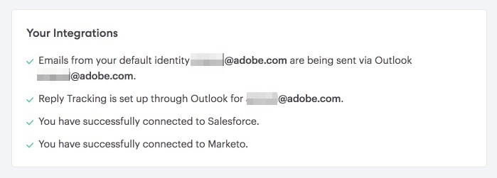
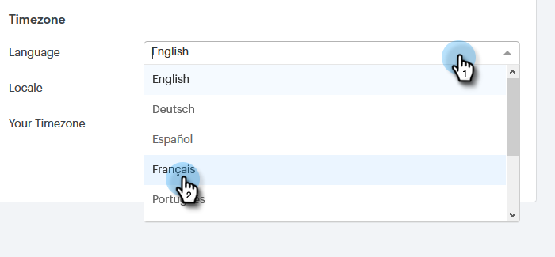

# Administrar su perfil {#manage-your-profile}

En tu página [!UICONTROL Mi perfil] puedes actualizar tu nombre, el idioma, la configuración regional y la zona horaria de tu cuenta, y también cambiar tu contraseña.

## Detalles de la cuenta {#account-details}

Aquí es donde puede actualizar su nombre y/o contraseña.

1. Haga clic en el icono del engranaje y seleccione **[!UICONTROL Configuración]**.

   

1. La página Mi perfil se abrirá de forma predeterminada. Para actualizar tu nombre, simplemente escribe los cambios y haz clic en **[!UICONTROL Guardar]**.

   

>[!NOTE]
>
>Su dirección de correo electrónico está configurada para verse solamente. Si necesita que lo cambien también, comuníquese con [Soporte técnico de Marketo](https://nation.marketo.com/t5/Support/ct-p/Support).

También puede cambiar la contraseña en esta sección. Los pasos se describen en este documento.

## Sus integraciones {#your-integrations}

En el lado derecho de la página, la sección [!UICONTROL Sus integraciones] proporciona el estado de todas las conexiones de su cuenta.

>[!NOTE]
>
>Si utiliza Exchange On Prem con Sales Connect, no se actualizarán las comprobaciones de estado de la integración del canal de entrega (primer elemento de línea) o el seguimiento de respuestas (segundo elemento de línea). Estamos trabajando para admitir esto en una versión futura.

## Zona horaria {#time-zone}

A continuación se indica cómo cambiar el idioma, la configuración regional o la zona horaria de la cuenta.

>[!NOTE]
>
>Idiomas admitidos: inglés, francés, alemán, japonés, portugués y español.

1. Haga clic en el icono del engranaje y seleccione **[!UICONTROL Configuración]**.

   

1. Para cambiar el idioma, haga clic en la lista desplegable **[!UICONTROL Idioma]** y elija.

   

1. La configuración regional hace referencia a la región en la que se habla ese idioma. Haga clic en el menú desplegable **[!UICONTROL Configuración regional]** y elija.

   

1. Haga clic en el menú desplegable **[!UICONTROL Su zona horaria]** y elija una.

   

1. Haga clic en **[!UICONTROL Guardar]** cuando termine.

   

¡Et voilà!
