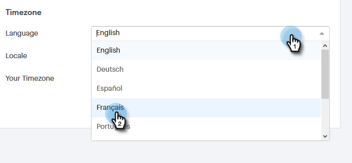

# Mi página de perfil {#my-profile-page}

En su página Mi perfil puede actualizar su nombre, el idioma, la configuración regional o la zona horaria de su cuenta, así como cambiar su contraseña.

## Detalles de la cuenta {#account-details}

Aquí es donde puede actualizar su nombre y/o contraseña.

1. Haga clic en el icono del engranaje y seleccione **Settings**.

   

1. La página Mi perfil se abre de forma predeterminada. Para actualizar su nombre, simplemente escriba los cambios y haga clic en **Guardar**.

   

>[!NOTE]
>
>Su dirección de correo electrónico está configurada para solo ver. Si necesita que esto también cambie, póngase en contacto con [Soporte de Marketo](https://nation.marketo.com/t5/Support/ct-p/Support).

También puede cambiar la contraseña en esta sección. Los pasos se describen en este documento.

## Sus integraciones {#your-integrations}

A la derecha de la página, la sección Sus integraciones proporciona el estado de todas las conexiones de la cuenta.

>[!NOTE]
>
>Si utiliza Exchange On Prem con conexión de ventas, no actualizará las comprobaciones de estado de integración de canal de entrega (primer artículo de línea) o seguimiento de respuestas (segundo artículo de línea). Estamos trabajando para admitir esto en una versión futura.

## Zona horaria {#time-zone}

Aquí se explica cómo cambiar el idioma, la configuración regional o la zona horaria de la cuenta.

>[!NOTE]
>
>Idiomas admitidos: inglés, francés, alemán, japonés, portugués, español.

1. Haga clic en el icono del engranaje y seleccione **Settings**.

   

1. Para cambiar el idioma, haga clic en la lista desplegable **Language** y elija una opción.

   

1. La configuración regional aquí se refiere a la región en la que se habla ese idioma. Haga clic en la lista desplegable **Locale** y elija una opción.

   

1. Haga clic en la lista desplegable **Your Timezone** y elija una opción.

   

1. Haga clic en **Guardar** cuando termine.

   

¡Et voilà!
