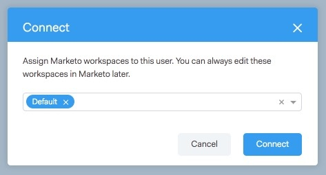

# Concesión de acceso a usuarios {#granting-access-to-users}

Siga los pasos de este artículo para otorgar a los usuarios de Conexión de ventas acceso a la conexión de Marketo. Esto desbloqueará funciones como Momentos interesantes en la fuente en directo y acceso a campañas de marketing.

Deberá invitar a los usuarios a Conexión de ventas [aquí](/help/marketo/product-docs/marketo-sales-connect/admin/invite-users.md), antes de que se vean en la página Marketo > Acceso de equipo (en Conexión de ventas), donde se concede acceso a la conexión de Marketo.

>[!CAUTION]
>
>Espere diez minutos después de conectar Conexión de ventas con Marketo antes de realizar estos pasos.

1. Seleccione uno o varios usuarios y haga clic en **Conectar**.

   >[!NOTE]
   >
   >La asignación de espacio de trabajo solo se puede realizar una vez al conceder acceso a los usuarios. Una vez configurado, tendrá que desconectar al usuario para cambiarlo.

   

1. Si la suscripción a Marketo tiene habilitados los espacios de trabajo, podrá asignar espacios de trabajo a cada usuario o conjunto de usuarios de forma masiva. Si no se seleccionan espacios de trabajo, se asignarán al espacio de trabajo predeterminado de Marketo.

   

1. Haga clic en la lista desplegable Workspace , seleccione los espacios de trabajo que desee y haga clic en **Connect**.

   

Puede agregar usuarios adicionales desde la página Administración de equipos y seguir los pasos anteriores para conectarlos.
