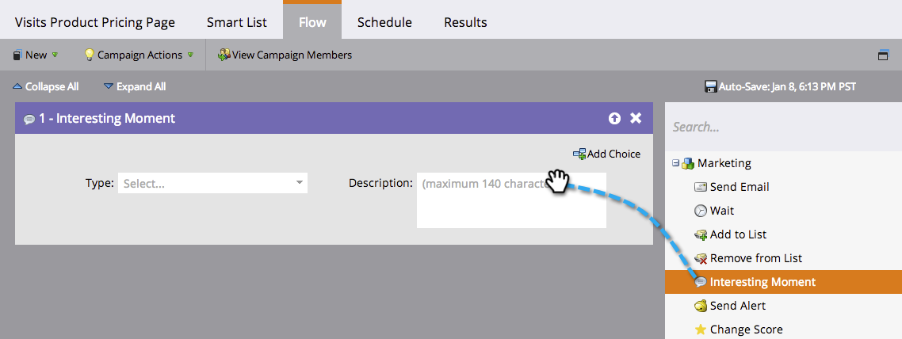

# Momentos interesantes en Sales Connect {#interesting-moments-in-sales-connect}

Los momentos interesantes son la clave para comunicarse con su equipo de ventas a través de Marketo Sales Connect.

>[!AVAILABILITY]
>
>Están disponibles solo para los clientes de [Marketo Sales Insight](/help/marketo/product-docs/marketo-sales-insight/msi-for-salesforce/features/tabs-in-the-msi-panel/interesting-moments/using-interesting-moments.md) y Marketo Sales Connect.

>[!PREREQUISITES]
>
>* Debe tener una conexión [con Salesforce CRM](/help/marketo/product-docs/marketo-sales-connect/crm/salesforce-integration/connect-your-sales-connect-account-to-salesforce.md){target="_blank"}
>* Debe ser el propietario del contacto o posible cliente de Salesforce
>* Debe tener acceso a [conceder acceso a la conexión de Marketo Engage](/help/marketo/product-docs/marketo-sales-connect/marketo/granting-access-to-users.md){target="_blank"}

## ¿Qué es un momento interesante? {#what-is-an-interesting-moment}

¡Eso depende de ti! Usted decide qué información es relevante para su equipo de ventas. Es posible que el equipo de ventas desee saber cuándo un posible cliente:

* Visita la página de precios del sitio web
* Hace clic en un vínculo de un correo electrónico para anunciar un nuevo producto
* Solicita una demostración del producto

## ¿Cómo puedo crear un momento interesante? {#how-do-i-create-an-interesting-moment}

1. Elija una [campaña inteligente](/help/marketo/product-docs/core-marketo-concepts/smart-campaigns/understanding-smart-campaigns.md), preferiblemente una que el equipo de ventas encuentre interesante si se activa.

   

1. Arrastre sobre el paso de flujo **Momentos interesantes**.

   

1. Seleccione un **tipo** (correo electrónico, hito o web).

   

1. Escriba un mensaje a su equipo de ventas en el campo **Descripción** que explique por qué es importante esta acción.

   

   >[!NOTE]
   >
   >Marketo SOAP también añadirá la fecha en la que se produjo y cómo se añadió el momento interesante (es decir, acción de posible cliente > paso de flujo, API de).

## ¿Qué aspecto tiene un momento interesante en Marketo?  {#what-does-an-interesting-moment-look-like-in-marketo}

Se mostrarán momentos interesantes en el [registro de actividades del posible cliente](/help/marketo/product-docs/core-marketo-concepts/smart-lists-and-static-lists/managing-people-in-smart-lists/using-the-person-detail-page.md).

## ¿Qué aspecto tiene un momento interesante en Sales Connect? {#what-does-an-interesting-moment-look-like-in-sales-connect}

Los momentos interesantes se mostrarán en tiempo real en el Live Feed de un usuario. Utilizamos el ID del propietario del posible cliente en Salesforce para mostrar los momentos interesantes de los usuarios de posibles clientes relevantes de los que son propietarios. Los usuarios pueden realizar un seguimiento rápido con los posibles clientes a través del correo electrónico, el teléfono o la campaña de ventas haciendo clic en la lista desplegable situada junto al nombre del posible cliente.

