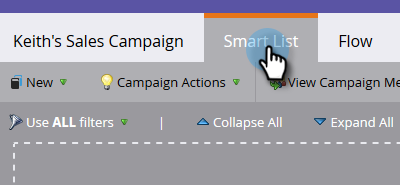
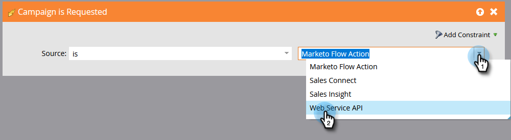
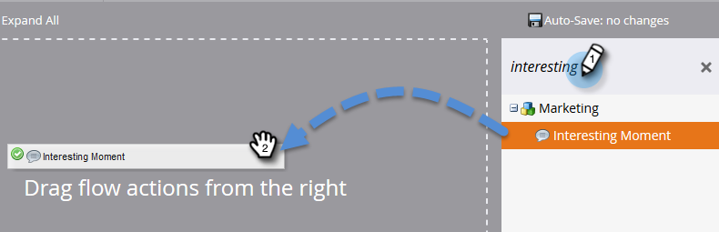

# Hacer una campaña visible para [!DNL Sales Connect] usuarios {#make-a-campaign-visible-to-sales-connect-users}

Las campañas solo se pueden compartir si se hacen visibles. Así es como se hace.

1. Seleccione (o cree) la campaña que desee compartir.

   

1. Haga clic en la ficha **[!UICONTROL Lista inteligente]**.

   

1. Agregar el déclencheur [!UICONTROL Se ha solicitado la campaña].

   

1. Para el origen, elija &quot;[!UICONTROL is]&quot; **[!UICONTROL API de servicio web]**.

   

1. Haga clic en la ficha **[!UICONTROL Flujo]**.

   

1. Agregar la acción de flujo [!UICONTROL Momento interesante].

   

1. Para [!UICONTROL Type], seleccione **[!UICONTROL Web]**.

   

1. En el cuadro [!UICONTROL Descripción], escriba un mensaje a su equipo de ventas. En este ejemplo utilizamos tokens para especificar el formulario que se rellenó.

   

1. Haga clic en la ficha **[!UICONTROL Programar]** y **[!UICONTROL Activar]** la campaña.

   
