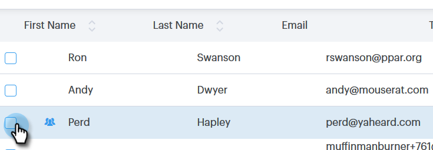

# Crear y eliminar contactos {#creating-and-deleting-contacts}

## Creación de contactos {#creating-contacts}

1. En la página [!UICONTROL Personas], haga clic en el botón **[!UICONTROL Acciones de grupo]** y seleccione **[!UICONTROL Crear contacto]**.

   

1. Introduzca el nombre/apellido y la dirección de correo electrónico, junto con cualquier otra información que desee. Haz clic en **[!UICONTROL Crear]** cuando termines, o en **[!UICONTROL Crear y agregar nuevo]** para agregar más contactos.

   

   >[!TIP]
   >
   >¿Quieres añadir varios contactos a la vez? [Haga clic aquí](/help/marketo/product-docs/marketo-sales-connect/people/managing-contacts/import-contacts-via-csv.md) para obtener información sobre cómo importar contactos a través de CSV.

## Eliminando contactos {#deleting-contacts}

1. En la página [!UICONTROL Personas], marque la casilla del contacto que desee eliminar.

   

   >[!NOTE]
   >
   >Para eliminar varios contactos, simplemente seleccione varias personas. Los pasos restantes serían los mismos.

1. Haga clic en los puntos (tres puntos verticales) y seleccione **[!UICONTROL Eliminar]**.

   

1. Haga clic en **[!UICONTROL Eliminar contacto]** para confirmar.

   
