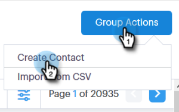

# Creación y eliminación de contactos {#creating-and-deleting-contacts}

## Creación de contactos {#creating-contacts}

1. En la página Personas , haga clic en el botón **Acciones de grupo** y seleccione **Crear contacto**.

   

1. Introduzca el nombre y apellidos y la dirección de correo electrónico, junto con cualquier otra información que desee. Haga clic en **Crear** cuando haya terminado, o **Crear y agregar nuevo** para agregar más contactos.

   

   >[!TIP]
   >
   >¿Quiere agregar varios contactos a la vez? [Haga clic aquí](/help/marketo/product-docs/marketo-sales-connect/people/managing-contacts/import-contacts-via-csv.md) para aprender a importar contactos a través de CSV.

## Eliminación de contactos {#deleting-contacts}

1. En la página Personas, marque la casilla del contacto que desee eliminar.

   

   >[!NOTE]
   >
   >Para eliminar varios contactos, simplemente seleccione varias personas. Los pasos restantes serían los mismos.

1. Haga clic en los datos (tres puntos verticales) y seleccione **Eliminar**.

   

1. Haga clic en **Eliminar contacto** para confirmar.

   
