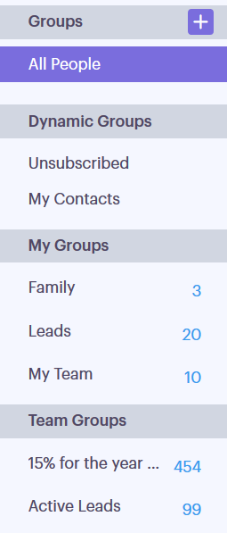

# Tipos de grupos {#group-types}

Obtenga información acerca de los distintos tipos de grupos en [!UICONTROL Conexión de ventas].

<table>
 <colgroup>
  <col>
  <col>
 </colgroup>
 <tbody>
  <tr>
   <th>Grupo</th>
   <th>Descripción</th>
  </tr>
  <tr>
   <td>
[!UICONTROL Todas las personas]
</td>
   <td>Todos los contactos de todos los usuarios visibles para usted.</td>
  </tr>
  <tr>
   <td colspan="1">
[!UICONTROL Grupos dinámicos]
</td>
   <td colspan="1">Mis contactos: Todos los contactos que posee. Cancelaciones de la suscripción: Contactos que han optado por no recibir correspondencia.</td>
  </tr>
  <tr>
   <td>
[!UICONTROL Mis grupos]
</td>
   <td>Grupos que ha creado. Pueden contener sus contactos o los contactos que se han compartido con usted.</td>
  </tr>
  <tr>
   <td>
[!UICONTROL Grupos de equipo]
</td>
   <td>Grupos que se han compartido con usted o que han compartido con usted. Pueden contener contactos de sus compañeros o contactos que haya compartido con ellos.</td>
  </tr>
 </tbody>
</table>
