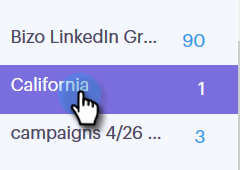
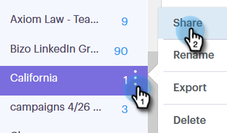

# Administrar grupos {#manage-groups}

Obtenga información sobre cómo administrar los grupos en Sales Connect.

## Crear un grupo {#create-a-group}

1. En la página Personas, haga clic en **+** junto a Grupos.

   

1. Asigne un nombre al grupo y haga clic en **Crear**.

   

   ¡Eso es todo!

## Añadir contactos a un grupo {#add-contacts-to-a-group}

1. En la página Personas, busque y seleccione el grupo al que desee agregar personas.

   

1. Haga clic en **Acciones de grupo** y seleccione **Crear contacto**.

   

   >[!NOTE]
   >
   >Esto agregará un contacto a la vez. Para agregar varios contactos al mismo tiempo, siga [estos pasos](/help/marketo/product-docs/marketo-sales-connect/people/managing-contacts/import-contacts-via-csv.md).

1. Rellene la información del contacto y haga clic en **Crear** (o **Crear y Añadir nuevo** para agregar otro).

   

   ¡Y ya terminaste!

   >[!NOTE]
   >
   >Es posible que tenga que hacer clic en actualizar para ver si se han agregado nuevos contactos.

## Compartir un grupo {#share-a-group}

1. En la página Personas, busque y seleccione el grupo que desee compartir.

   

1. Haga clic en los puntos (tres puntos verticales) y seleccione **Compartir**.

   

1. Haga clic en la lista desplegable y elija el equipo con el que desee compartir el grupo.

   

1. Haga clic en **Compartir**.

   

   Usted sigue siendo el propietario del grupo, pero ahora aparecerá en Grupos de equipos.

## Dejar de compartir un grupo {#unshare-a-group}

1. En la página Personas, busque y seleccione el grupo que desee dejar de compartir.

   

1. Haga clic en los puntos (tres puntos verticales) y seleccione **Compartir**.

   

1. Haga clic en la **X** al lado del equipo con el que compartió el grupo y, a continuación, haga clic fuera del modal.

   

   El grupo ya no se comparte.

## Cambiar el nombre de un grupo {#rename-a-group}

1. En la página Personas, busque y seleccione el grupo al que desea cambiar el nombre.

   

1. Haga clic en los puntos (tres puntos verticales) y seleccione **Cambiar nombre**.

   

1. Escriba el nuevo nombre y pulse Intro.

   

## Eliminar un grupo {#delete-a-group}

1. En la página Personas, busque y seleccione el grupo que desee eliminar.

   

1. Haga clic en los puntos (tres puntos verticales) y seleccione **Eliminar**.

   

1. Haga clic en **Eliminar** para confirmar.

   
