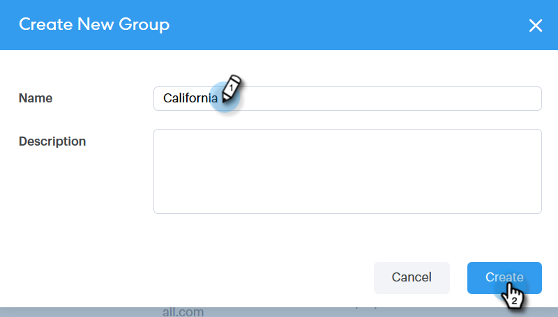
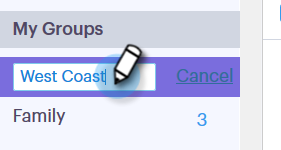

# Administrar grupos {#manage-groups}

Aprenda a administrar sus grupos en Sales Connect.

## Crear un grupo {#create-a-group}

1. En la página Personas, haga clic en **+** junto a Grupos.

   

1. Nombre el grupo y haga clic en **Crear**.

   

   ¡Eso es todo!

## Agregar contactos a un grupo {#add-contacts-to-a-group}

1. En la página Personas, busque y seleccione el grupo al que desee agregar personas.

   

1. Clic **Acciones de grupo** y seleccione **Crear contacto**.

   

   >[!NOTE]
   >
   >Esto añadirá un contacto a la vez. Para agregar varios contactos al mismo tiempo, siga [estos pasos](/help/marketo/product-docs/marketo-sales-connect/people/managing-contacts/import-contacts-via-csv.md).

1. Rellene la información del contacto y haga clic en **Crear** (o **Crear y agregar nuevo** para agregar otro).

   

   ¡Y has terminado!

   >[!NOTE]
   >
   >Es posible que tenga que actualizar para ver los contactos nuevos agregados.

## Compartir un grupo {#share-a-group}

1. En la página Personas, busque y seleccione el grupo que desea compartir.

   

1. Haga clic en los puntos (tres puntos verticales) y seleccione **Compartir**.

   

1. Haga clic en el menú desplegable y seleccione el equipo con el que desea compartir el grupo.

   

1. Clic **Compartir**.

   

   Sigue siendo el propietario del grupo, pero ahora aparecerá en Grupos de equipo.

## Dejar de compartir un grupo {#unshare-a-group}

1. En la página Personas, busque y seleccione el grupo que desea dejar de compartir.

   

1. Haga clic en los puntos (tres puntos verticales) y seleccione **Compartir**.

   

1. Haga clic en **X** junto al equipo con el que compartió el grupo y, a continuación, haga clic en fuera del modal.

   

   El grupo ya no se comparte.

## Cambiar nombre de grupo {#rename-a-group}

1. En la página Personas, busque y seleccione el grupo cuyo nombre desea cambiar.

   

1. Haga clic en los puntos (tres puntos verticales) y seleccione **Cambiar nombre**.

   

1. Escriba el nuevo nombre y pulse Intro.

   

## Eliminar un grupo {#delete-a-group}

1. En la página Personas, busque y seleccione el grupo que desea eliminar.

   

1. Haga clic en los puntos (tres puntos verticales) y seleccione **Eliminar**.

   

1. Clic **Eliminar** para confirmar.

   
