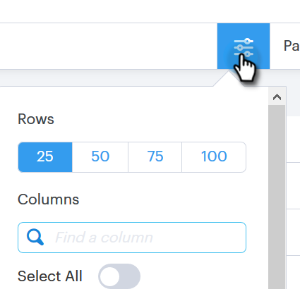

# Columnas de la página Personas {#people-page-columns}

Tiene la opción de personalizar la información de contacto que ve eligiendo las columnas que desea mostrar.

## Cómo seleccionar columnas {#how-to-select-columns}

1. En la página [!UICONTROL Personas], haga clic en el icono Configuración de lista.

   

1. Desplácese y seleccione las columnas que desee (también puede hacer clic en **[!UICONTROL Seleccionar todo]** si desea todas las columnas). Haga clic en para salir de la lista cuando haya terminado.

   

## Descripciones de columna {#column-descriptions}

<table>
 <colgroup>
  <col>
  <col>
 </colgroup>
 <tbody>
  <tr>
   <th>Columna</th>
   <th>Descripción</th>
  </tr>
  <tr>
   <td>[!UICONTROL Nombre (predeterminado)]</td>
   <td>Nombre</td>
  </tr>
  <tr>
   <td>[!UICONTROL Apellidos (predeterminado)]</td>
   <td>Apellido</td>
  </tr>
  <tr>
   <td colspan="1">[!UICONTROL Correo electrónico (predeterminado)]</td>
   <td colspan="1">Correo electrónico</td>
  </tr>
  <tr>
   <td colspan="1">[!UICONTROL Teléfono]</td>
   <td colspan="1">Número de teléfono</td>
  </tr>
  <tr>
   <td colspan="1">[!UICONTROL Título (predeterminado)]</td>
   <td colspan="1">Cargo</td>
  </tr>
  <tr>
   <td>[!UICONTROL Company (predeterminado)]</td>
   <td>Nombre de la compañía</td>
  </tr>
  <tr>
   <td>[!UICONTROL Campaign (predeterminado)]</td>
   <td>Campaña de ventas en la que se encuentra la persona</td>
  </tr>
  <tr>
   <td># [!UICONTROL Campañas]</td>
   <td>Número total de campañas de ventas de las que la persona ha formado parte</td>
  </tr>
  <tr>
   <td># [!UICONTROL Llamadas]</td>
   <td>Número total de llamadas realizadas a esta persona</td>
  </tr>
  <tr>
   <td># [!UICONTROL Correos electrónicos]</td>
   <td>Número total de correos electrónicos enviados a esta persona</td>
  </tr>
  <tr>
   <td>[!UICONTROL Fecha de vencimiento de tarea]</td>
   <td>Fecha de vencimiento de la tarea</td>
  </tr>
  <tr>
   <td># [!UICONTROL Eventos (predeterminado)]</td>
   <td>Número total de eventos de participación de la persona (vistas, clics y respuestas)</td>
  </tr>
  <tr>
   <td># [!UICONTROL Actividades (predeterminado)]</td>
   <td>Número total de actividades realizadas por el usuario para este posible cliente (correos electrónicos, llamadas y tareas)</td>
  </tr>
  <tr>
   <td>[!UICONTROL Consentimiento]</td>
   <td>
Interés legítimo, ejecución de un contrato, cumplimiento de la obligación legal, protección de los intereses vitales, interés público/autoridad oficial y otros
</td>
  </tr>
  <tr>
   <td>[!UICONTROL Abrir tareas]</td>
   <td>Número de tareas abiertas para esta persona</td>
  </tr>
  <tr>
   <td># [!UICONTROL Vistas]</td>
   <td>Número total de vistas realizadas por esta persona</td>
  </tr>
  <tr>
   <td># [!UICONTROL Clics]</td>
   <td>Número total de clics de esta persona</td>
  </tr>
  <tr>
   <td># [!UICONTROL Respuestas]</td>
   <td>Número total de respuestas de esta persona</td>
  </tr>
  <tr>
   <td>[!UICONTROL Última actualización]</td>
   <td>Fecha en la que se actualizó por última vez el registro de persona</td>
  </tr>
  <tr>
   <td>[!UICONTROL Creator]</td>
   <td>Nombre del usuario que creó a la persona</td>
  </tr>
  <tr>
   <td>[!UICONTROL Source]</td>
   <td>Source de dónde se creó la persona</td>
  </tr>
  <tr>
   <td>[!UICONTROL Grupos (predeterminado)]</td>
   <td>Grupos de los que forma parte la persona</td>
  </tr>
  <tr>
   <td colspan="1">[!UICONTROL Cancelado la suscripción]</td>
   <td colspan="1">Estado de cancelación de suscripción de ventas</td>
  </tr>
 </tbody>
</table>
