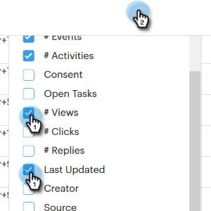

# Columnas de la página Personas {#people-page-columns}

Tiene la opción de personalizar la información de contacto que ve eligiendo qué columnas se muestran.

## Cómo seleccionar columnas {#how-to-select-columns}

1. En la página Personas, haga clic en el icono Configuración de Lista.

   

1. Desplácese y seleccione las columnas que desee (también puede hacer clic en **Seleccionar todo** si desea cada columna). Haga clic fuera de la lista cuando termine.

   

## Descripciones de columnas {#column-descriptions}

<table> 
 <colgroup> 
  <col> 
  <col> 
 </colgroup> 
 <tbody> 
  <tr> 
   <th>Columna</th> 
   <th>Descripción</th> 
  </tr> 
  <tr> 
   <td>Nombre (predeterminado)</td> 
   <td>Nombre</td> 
  </tr> 
  <tr> 
   <td>Apellido (predeterminado)</td> 
   <td>Apellido</td> 
  </tr> 
  <tr> 
   <td colspan="1">Correo electrónico (predeterminado)</td> 
   <td colspan="1">Dirección de correo electrónico</td> 
  </tr> 
  <tr> 
   <td colspan="1">Teléfono</td> 
   <td colspan="1">Número de teléfono</td> 
  </tr> 
  <tr> 
   <td colspan="1">Título (predeterminado)</td> 
   <td colspan="1">Puesto de trabajo</td> 
  </tr> 
  <tr> 
   <td>Compañía (predeterminado)</td> 
   <td>Nombre de compañía</td> 
  </tr> 
  <tr> 
   <td>Campaña (predeterminado)</td> 
   <td>Campaña de ventas en la que se encuentra la persona</td> 
  </tr> 
  <tr> 
   <td># Campañas</td> 
   <td>Número total de campañas de ventas de las que la persona ha formado parte</td> 
  </tr> 
  <tr> 
   <td>Nº de llamadas</td> 
   <td>Número total de llamadas realizadas a esta persona</td> 
  </tr> 
  <tr> 
   <td>N.º de correos electrónicos</td> 
   <td>Número total de correos electrónicos enviados a esta persona</td> 
  </tr> 
  <tr> 
   <td>Fecha de vencimiento de tarea</td> 
   <td>Fecha de vencimiento de la tarea</td> 
  </tr> 
  <tr> 
   <td># Eventos (predeterminado)</td> 
   <td>Número total de eventos de participación por persona (Vistas, clics y respuestas)</td> 
  </tr> 
  <tr> 
   <td># Actividades (predeterminado)</td> 
   <td>Número total de actividades realizadas por el usuario para este posible cliente (correos electrónicos, llamadas y tareas)</td> 
  </tr> 
  <tr> 
   <td>Consentimiento</td> 
   <td>
Interés legítimo, ejecución de un contrato, cumplimiento de una obligación legal, protección de intereses vitales, interés público/autoridad oficial y otros
</td> 
  </tr> 
  <tr> 
   <td>Abrir Tareas</td> 
   <td>Número de tareas abiertas para esta persona</td> 
  </tr> 
  <tr> 
   <td># Vistas</td> 
   <td>Número total de vistas de esta persona</td> 
  </tr> 
  <tr> 
   <td>Nº de clics</td> 
   <td>Número total de clics por esta persona</td> 
  </tr> 
  <tr> 
   <td>N.º de respuestas</td> 
   <td>Número total de respuestas de esta persona</td> 
  </tr> 
  <tr> 
   <td>Última actualización</td> 
   <td>Fecha en la que se actualizó por última vez el registro de persona</td> 
  </tr> 
  <tr> 
   <td>Creador</td> 
   <td>Nombre del usuario que creó la persona</td> 
  </tr> 
  <tr> 
   <td>Origen</td> 
   <td>Origen de la ubicación desde la que se creó la persona</td> 
  </tr> 
  <tr> 
   <td>Grupos (predeterminado)</td> 
   <td>Grupos de los que forma parte la persona</td> 
  </tr> 
  <tr> 
   <td colspan="1">No suscrito</td> 
   <td colspan="1">Estado de cancelación de suscripción de ventas</td> 
  </tr> 
 </tbody> 
</table>
