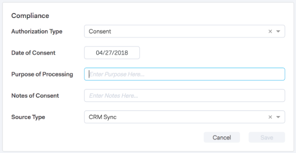
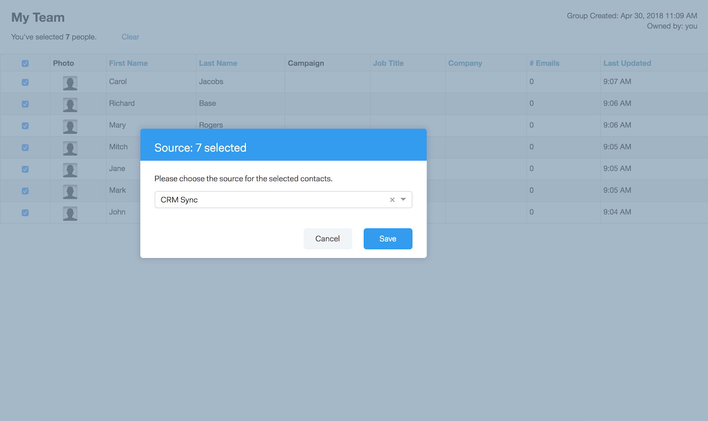

# Conformidad con Sales Connect y GDPR {#sales-connect-and-gdpr-compliance}

El Reglamento General de Protección de Datos (RGPD) es una ley de la Unión Europea que entró en vigor el 25 de mayo de 2018.

## Información general {#overview}

Su objetivo es reforzar los derechos de los interesados dentro de la Unión Europea (UE) y del Espacio Económico Europeo (EEE) con respecto a la forma en que se utilizan y protegen sus datos personales. Por &quot;datos personales&quot; se entiende toda información relacionada con una persona física identificada o identificable.

El RGPD está estructurado en torno a seis principios fundamentales (detallados en el artículo 5 de la legislación):

1. Transparencia sobre cómo se utilizarán los datos y para qué se utilizarán.
1. Garantizar que los datos recopilados se utilicen únicamente para los fines especificados explícitamente en el momento de la recopilación.
1. Limitar la recopilación de datos a lo necesario para cumplir el propósito para el que se recopila.
1. Asegurar que los datos sean precisos.
1. Almacenar los datos sólo durante el tiempo que sea necesario dentro del objetivo previsto.
1. Prevención del uso no autorizado o la pérdida accidental de los datos mediante el despliegue de medidas de seguridad apropiadas.

Además, existe un nuevo requisito de rendición de cuentas para poder demostrar cómo se administra y rastrea el cumplimiento. Esto significa mantener registros de cómo y por qué se recopilaron los datos personales, así como la documentación de los procesos establecidos para protegerlos.

## ¿A quién se aplica? {#to-whom-does-it-apply}

El RGPD se aplica a cualquier organización dentro o fuera de la UE que comercialice bienes o servicios a sujetos de datos de la UE y del EEE o que realice un seguimiento de su comportamiento. Si usted hace negocios con sujetos de datos en Europa que involucren el procesamiento de sus datos personales, esta legislación se aplica a usted. Las sanciones por incumplimiento son importantes, con grandes multas para los infractores del Reglamento; la multa máxima por una sola infracción es de 20 millones de euros, o el 4% del volumen de negocios mundial anual, lo que sea bueno.

## Implicaciones para la mercadotecnia {#implications-for-marketing}

Los especialistas en mercadotecnia buscan crear experiencias de cliente que se sientan personales y humanas, basadas en la confianza y entregadas con cuidado. Aunque el RGPD no utiliza estos términos, los objetivos son los mismos: respetar los derechos de los clientes y ganarse la confianza. Para crear y mantener esa confianza, los especialistas en mercadotecnia deben estar en sintonía con el modo, el momento y el motivo por el que sus clientes desean participar. Es fundamental que se respeten las preferencias de los clientes, no sólo como un requisito legal, sino como la base de las prácticas de compromiso centradas en los clientes.

La manera en que los especialistas en mercadotecnia abordan estas mayores expectativas en cuanto a la recopilación, el uso y la seguridad de los datos personales que se utilizan habitualmente en el curso de su trabajo es clave, y Marketing puede ayudar a satisfacer esas expectativas.

Existen dos aspectos clave del RGPD en los que los especialistas en mercadotecnia deben revisar las prácticas pasadas, actuales y futuras. El primero es el consentimiento del individuo para procesar sus datos personales, y el segundo es la rendición de cuentas, es decir, poder demostrar cómo se siguen los principios del RGPD.

Proporcionamos amplia información sobre el consentimiento y la rendición de cuentas dentro de la plataforma de Marketing en nuestro libro electrónico, [GDPR y The Marketer](https://www.marketo.com/ebooks/the-gdpr-and-the-marketer/). En este artículo, sin embargo, nos centraremos específicamente en las nuevas funciones de Marketing Cloud Sales Connect que ayudarán a su organización a adherirse a las reglas de RGPD.

## Cumplimiento del RGPD en MarketingTo Sales Connect {#gdpr-compliance-in-marketo-sales-connect}

Marketingto Sales Connect es una poderosa aplicación, parte de la Plataforma de compromiso de marketing, que proporciona un único flujo de trabajo y vista para ventas y marketing que acelera la canalización de forma colectiva mediante la colaboración. Se ha creado una nueva funcionalidad en Marketingto Sales Connect de forma específica, teniendo en cuenta el cumplimiento del RGPD. Describiremos las tres funciones y explicaremos cómo, cuando se utilicen correctamente, ayudarán a su organización a cumplir con el RGPD.

## Tarjeta de cumplimiento {#compliance-card}

Marketingto Sales Connect incluye una tarjeta de conformidad en la Vista Detalles de la persona para proporcionar información clave sobre el tipo de autorización de un contacto, así como su tipo de origen. Esto permite a los usuarios agregar y rastrear fácilmente información crítica para la privacidad de los datos, y les ayuda a tomar decisiones más informadas sobre la estrategia de campaña y divulgación.

Tipo de autorización de contacto

Dentro de la tarjeta de cumplimiento, los usuarios pueden rastrear la base legal para procesar los datos personales de un contacto a través de la lista desplegable de autorización. El comprender el tipo de autorización de un contacto ayuda a los usuarios de Marketing Cloud a tomar decisiones más informadas sobre las prácticas de divulgación, lo que garantiza que cada campaña o compromiso sea legal y apropiada.

Los usuarios pueden elegir entre varias opciones, entre las que se incluyen:

* Consentimiento
* Interés legítimo
* Ejecución de un contrato
* Cumplimiento de la obligación legal
* Protección de los intereses vitales
* Interés público/Autoridad Oficial
* Otros

Tipo de origen de contacto

Dentro de la nueva tarjeta de cumplimiento, los usuarios pueden rastrear el origen de un contacto. El tipo de origen define de dónde proviene la información de un contacto cuando se carga inicialmente en MarketingTo Sales Connect. El comprender el tipo de fuente de un contacto también ayuda a tomar decisiones con respecto a las prácticas de divulgación, así como a determinar qué otros sistemas o ubicaciones almacenan datos personales, asegurando que cada participación esté en línea con la legislación del RGPD.

Nuevamente, los usuarios tienen varias opciones desplegables para elegir, entre las que se incluyen:

* Sincronización de CRM
* Importar
* Carga manual
* Extensión de Chrome
* Otros

Edición de la tarjeta de cumplimiento

Cuando la Vista Detalles de persona esté abierta, haga clic en **Editar** en la tarjeta de cumplimiento.

Verá dos listas desplegables: Tipo de autorización y Tipo de origen.

Si elige &quot;Consentimiento&quot; como Tipo de autorización, hay dos campos obligatorios: Aparecerán &quot;Fecha de consentimiento&quot; y &quot;Finalidad del procesamiento&quot;. Estos dos campos no se aplican a otras opciones.

Si selecciona &quot;Otro&quot; para Tipo de autorización o Tipo de origen, puede introducir texto para describir el Tipo de origen.

Bulk Actions** Marketing to Sales Connect también permite actualizar de forma masiva los tipos de origen y autorización de un contacto, lo que ahorra un tiempo valioso en el proceso de cumplimiento.

Al seleccionar uno o varios contactos en la página Personas, aparecen los botones Autorización y Origen en el contenedor superior. Con estos botones, puede configurar la Autorización o el Origen de varios contactos simultáneamente.

Al hacer clic en el modal Autorización, aparece una ventana emergente con opciones desplegables que coinciden con las de la tarjeta de cumplimiento.

Después de actualizar el tipo de autorización, recibirá una ventana emergente de confirmación y podrá ver los detalles actualizados en la tarjeta de conformidad en la Vista Detalles de persona.

Del mismo modo, el tipo de origen también se puede actualizar de forma masiva haciendo clic en el modal de origen.

Después de seleccionar el tipo de origen correcto para los contactos seleccionados, aparecerá una ventana de confirmación para confirmar la actualización correcta.

## Exportación de datos de contacto de Marketing a Sales Connect {#exporting-contact-data-from-marketo-sales-connect}

Puede exportar la información de contacto desde la Vista Detalles de persona. La exportación descargará un archivo .CSV con las siguientes columnas:

<table> 
 <colgroup> 
  <col> 
  <col> 
  <col> 
 </colgroup> 
 <tbody> 
  <tr> 
   <td>Nombre</td> 
   <td>Sitio web</td> 
   <td>Facebook</td> 
  </tr> 
  <tr> 
   <td>Apellido</td> 
   <td>Otros</td> 
   <td>Twitter</td> 
  </tr> 
  <tr> 
   <td>Compañía</td> 
   <td>Actualizado en</td> 
   <td>LinkedIn</td> 
  </tr> 
  <tr> 
   <td>Título</td> 
   <td>Creado en</td> 
   <td>Exportado en</td> 
  </tr> 
  <tr> 
   <td>ID de correo electrónico</td> 
   <td>ID de Salesforce</td> 
   <td> </td> 
  </tr> 
  <tr> 
   <td>Número de teléfono</td> 
   <td>ID de persona</td> 
   <td> </td> 
  </tr> 
 </tbody> 
</table>

>[!NOTE]
>
>Esto sólo se puede hacer de uno en uno. Actualmente no existe ninguna funcionalidad que permita la exportación masiva de contactos.

Para exportar la información de contacto, haga clic en los tres puntos verticales del encabezado de Vista de detalles de la persona y seleccione **Exportar**. El archivo .CSV se descargará automáticamente.

>[!NOTE]
>
>El RGPD también requiere la capacidad de eliminar contactos de la interfaz de usuario, pero MarketingTo Sales Connect ya posee esta funcionalidad.

## Anula la suscripción {#unsubscribes}

Una esfera del RGPD que se suele malinterpretar incluye los contactos que se cancelan de la base de datos de la organización. Para cumplir las nuevas reglas de protección de datos de quienes decidan cancelar la suscripción, se ha incluido la siguiente funcionalidad en Marketingto Sales Connect:

**Vínculos de cancelación de suscripción:los vínculos de** cancelación de suscripción se anexarán automáticamente a todos los mensajes de correo electrónico enviados desde la aplicación web de Sales Connect para garantizar que los contactos tengan una forma accesible de desactivar la suscripción.\
**Cancelar suscripción Sincronización:** los usuarios pueden sincronizar las cancelaciones de suscripción con y desde su CRM (Salesforce) para garantizar que las notificaciones de exclusión estén actualizadas.\
**Historial de cancelación de suscripciones:** los usuarios pueden ver las exclusiones y las exclusiones históricas en la Vista Detalles de la persona.\
**Eliminación de la cancelación de la suscripción:** para volver a seleccionar un contacto no suscrito, el usuario debe tener privilegios de administrador y demostrar que el contacto ha dado un nuevo consentimiento para ponerse en contacto con ellos.

## Actualizaciones futuras {#future-updates}

Como entusiasta defensor del poder y la centralidad del cliente en la economía de compromiso, Marketing entiende la importancia de poner la privacidad y la protección de datos en manos del sujeto de datos. Al igual que con otras leyes de protección de datos, el cumplimiento del RGPD requiere compromiso tanto de Marketing como de nuestros clientes. Este artículo está diseñado para ayudarle a utilizar Marketing de una manera adecuada para respaldar el cumplimiento del RGPD de su organización.

Seguiremos de cerca las directrices aplicables del RGPD emitidas por las autoridades reguladoras y la legislación conexa. Las actualizaciones se publicarán en nuestro Centro de confianza en [trust.marketo.com](https://trust.marketo.com).
