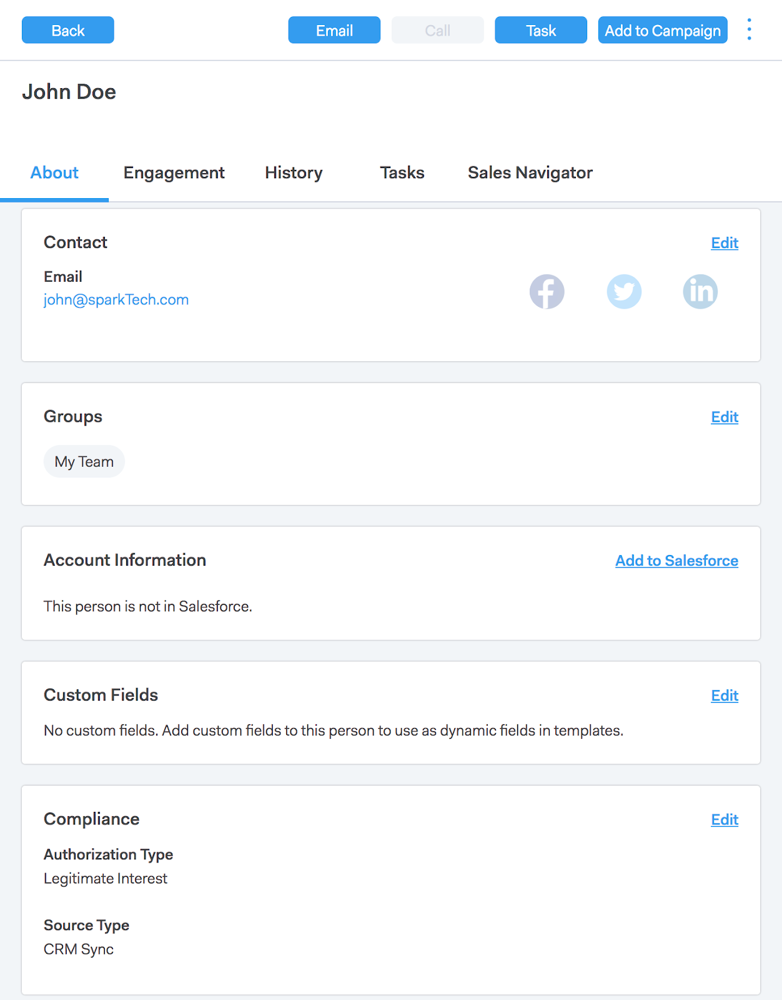

# Conexión de ventas y cumplimiento del RGPD {#sales-connect-and-gdpr-compliance}

El Reglamento General de Protección de Datos (RGPD) es la legislación de la Unión Europea que entró en vigor el 25 de mayo de 2018.

## Información general {#overview}

Su objetivo es reforzar los derechos de los interesados dentro de la Unión Europea (UE) y el Espacio Económico Europeo (EEE) con respecto a cómo se utilizan y protegen sus datos personales. Por &quot;datos personales&quot; se entiende toda información relacionada con una persona física identificada o identificable.

El RGPD se estructura en torno a seis principios clave (detallados en el artículo 5 de la legislación):

1. Transparencia sobre cómo se utilizarán los datos y para qué se utilizarán.
1. Garantizar que los datos recopilados se utilicen únicamente para los fines especificados explícitamente en el momento de la recopilación.
1. Limitar la recopilación de datos a lo necesario para servir al propósito para el que se recopilan.
1. Garantizar que los datos sean precisos.
1. Almacenar los datos solo durante el tiempo necesario dentro de su propósito previsto.
1. Prevenir el uso no autorizado o la pérdida accidental de los datos mediante la aplicación de las medidas de seguridad adecuadas.

Además, hay un nuevo requisito de responsabilidad para poder demostrar cómo se administra y se rastrea el cumplimiento. Esto significa mantener registros de cómo y por qué se recopilaron los datos personales, así como la documentación de los procesos establecidos para protegerlos.

## ¿A quién se aplica? {#to-whom-does-it-apply}

El RGPD se aplica a cualquier organización dentro o fuera de la UE que comercialice bienes o servicios a interesados dentro de la UE y el EEE, o que realice un seguimiento de sus comportamientos. Si realiza negocios con interesados en Europa que impliquen el procesamiento de sus datos personales, esta legislación se aplica a usted. Las sanciones por incumplimiento son significativas, con grandes multas para aquellos que incumplan la normativa; la multa máxima por una sola infracción es de 20 millones de euros o el 4% de la facturación anual mundial, lo que sea bueno.

## Implicaciones para el marketing {#implications-for-marketing}

El objetivo de los especialistas en marketing es crear experiencias de cliente que se sientan personales y humanas, basadas en la confianza y entregadas con cuidado. Aunque el RGPD no utiliza estos términos, los objetivos son los mismos: respetar los derechos de los clientes y ganarse su confianza. Para crear y mantener esa confianza, los especialistas en marketing deben estar en sintonía con el cómo, el cuándo y el por qué de sus clientes quieren participar. Es fundamental que se respeten las preferencias de los clientes, no solo como requisito legal, sino como base de las prácticas de participación centradas en el cliente.

La forma en que los especialistas en marketing afrontan estas mayores expectativas en torno a la recopilación, el uso y la seguridad de los datos personales que se utilizan habitualmente en el transcurso de su trabajo es fundamental, y Marketo puede ayudar a cumplirlas.

Existen dos aspectos clave del RGPD en los que los especialistas en marketing deben revisar las prácticas pasadas, actuales y futuras. El primero es el consentimiento de la persona para procesar sus datos personales, y el segundo es la responsabilidad, a saber, poder demostrar cómo se siguen los principios del RGPD.

Proporcionamos amplia información sobre el consentimiento y la responsabilidad dentro de la plataforma Marketo en nuestro libro electrónico, [RGPD y experto en marketing](https://www.marketo.com/ebooks/the-gdpr-and-the-marketer/). Sin embargo, en este artículo nos centraremos específicamente en las nuevas funciones de Marketo Sales Connect que ayudarán a su organización a adherirse a las reglas del RGPD.

## Cumplimiento del RGPD en Marketo Sales Connect {#gdpr-compliance-in-marketo-sales-connect}

Marketo Sales Connect es una potente aplicación, parte de Marketo Engagement Platform, que proporciona un flujo de trabajo y una vista únicos para que las ventas y el marketing impulsen colectivamente la canalización más rápido mediante la participación colaborativa. La nueva funcionalidad de Marketo Sales Connect se ha creado específicamente teniendo en cuenta el cumplimiento del RGPD. Describiremos las tres funciones y explicaremos cómo, cuando se utilicen correctamente, ayudarán a los esfuerzos de cumplimiento del RGPD de su organización.

## Tarjeta de cumplimiento {#compliance-card}

Marketo Sales Connect incluye una tarjeta de conformidad en la vista de detalles de la persona para proporcionar información clave sobre el tipo de autorización de un contacto, así como su tipo de origen. Esto permite a los usuarios añadir y rastrear fácilmente la información crítica para la privacidad de los datos y les ayuda a tomar decisiones más informadas sobre la estrategia de campaña/alcance.

Tipo de autorización de contacto

Dentro de la tarjeta de cumplimiento, los usuarios pueden realizar un seguimiento de la base legal para procesar los datos personales de un contacto a través de la lista desplegable Autorización. Comprender el tipo de autorización de un contacto ayuda a los usuarios de Marketo Sales Connect a tomar decisiones más informadas sobre las prácticas de divulgación, lo que garantiza que cada campaña o participación sea legal y adecuada.

Los usuarios tienen numerosas opciones para elegir, entre las que se incluyen:

* Consentimiento
* Interés legítimo
* Rendimiento de un contrato
* Cumplimiento con la obligación legal
* Protección de intereses vitales
* Autoridad oficial/de interés público
* Otro

Tipo de origen de contacto

En la nueva tarjeta de cumplimiento, los usuarios pueden realizar un seguimiento del origen de un contacto. El tipo de fuente define la procedencia de la información de un contacto cuando se cargó inicialmente en Marketo Sales Connect. Comprender el tipo de fuente de un contacto también ayuda a tomar decisiones sobre las prácticas de divulgación, así como a determinar qué otros sistemas o ubicaciones se almacenan los datos personales, lo que garantiza que cada participación esté en línea con la legislación del RGPD.

De nuevo, los usuarios tienen varias opciones desplegables para elegir, entre ellas:

* Sincronización de CRM
* Importar
* Carga manual
* Extensión de Chrome
* Otro

Edición de la tarjeta de cumplimiento

Cuando la Vista de detalles de persona esté abierta, haga clic en **Editar** en la tarjeta de cumplimiento.

Verá dos menús desplegables: Tipo de autorización y Tipo de origen.

Si elige &quot;Consentimiento&quot; como tipo de autorización, aparecen dos campos obligatorios: &quot;Fecha de consentimiento&quot; y &quot;Propósito del procesamiento&quot;. Estos dos campos no son aplicables a otras opciones.

Si se elige &quot;Otro&quot; para el tipo de autorización o el tipo de origen, se puede introducir texto para describir el tipo de origen.

Acciones masivas** Marketo Sales Connect también permite actualizar de forma masiva los tipos de origen y autorización de un contacto, lo que ahorra un tiempo valioso en el proceso de conformidad.

Al seleccionar uno o varios contactos de la página Personas, los botones Autorización y Origen aparecen en el contenedor superior. Con estos botones, puede establecer la Autorización o el Origen de varios contactos simultáneamente.

Al hacer clic en el modal Autorización, aparece una ventana emergente con opciones desplegables que coinciden con las de la tarjeta de conformidad.

Una vez actualizado el tipo de autorización, recibirá una ventana emergente de confirmación y podrá ver los detalles actualizados en la tarjeta de cumplimiento en la vista de detalles de la persona.

Del mismo modo, el Tipo de origen también se puede actualizar de forma masiva haciendo clic en el modal Origen.

Después de seleccionar el Tipo de origen correcto para los contactos seleccionados, aparece una ventana de confirmación para confirmar que la actualización se ha realizado correctamente.

## Exportación De Datos De Contacto Desde Marketo Sales Connect {#exporting-contact-data-from-marketo-sales-connect}

Puede exportar la información de contacto desde la Vista de detalles de la persona. La exportación descargará un archivo .CSV con las siguientes columnas:

<table> 
 <colgroup> 
  <col> 
  <col> 
  <col> 
 </colgroup> 
 <tbody> 
  <tr> 
   <td>Nombre</td> 
   <td>Sitio web</td> 
   <td>Facebook</td> 
  </tr> 
  <tr> 
   <td>Apellido</td> 
   <td>Otro</td> 
   <td>Twitter</td> 
  </tr> 
  <tr> 
   <td>Compañía</td> 
   <td>Actualizado en</td> 
   <td>LinkedIn</td> 
  </tr> 
  <tr> 
   <td>Título</td> 
   <td>Creado en</td> 
   <td>Exportado el</td> 
  </tr> 
  <tr> 
   <td>Identificación de email</td> 
   <td>Identificación de Salesforce</td> 
   <td> </td> 
  </tr> 
  <tr> 
   <td>Número de teléfono</td> 
   <td>Identificación de la persona</td> 
   <td> </td> 
  </tr> 
 </tbody> 
</table>

>[!NOTE]
>
>Esto solo se puede hacer con un contacto a la vez. Actualmente no hay ninguna funcionalidad que permita exportaciones masivas de contactos.

Para exportar la información de contacto, haga clic en los tres puntos verticales del encabezado de la vista de detalles de la persona y seleccione **Exportar**. El archivo .CSV se descargará automáticamente.

>[!NOTE]
>
>El RGPD también requiere la posibilidad de eliminar contactos de la interfaz de usuario, pero Marketo Sales Connect ya posee esta funcionalidad.

## Cancela suscripción {#unsubscribes}

Un área del RGPD comúnmente malentendida incluye contactos que cancelan la suscripción a la base de datos de la organización. Para cumplir con las nuevas reglas de protección de los datos de aquellos que deciden cancelar la suscripción, se ha incluido la siguiente funcionalidad en Marketo Sales Connect:

**Vínculos de cancelación de suscripción:** Los vínculos de cancelación de suscripción se adjuntarán automáticamente a todos los mensajes de correo electrónico enviados desde la aplicación web de Sales Connect para garantizar que los contactos disponen de un método accesible de exclusión.\
**Cancelar suscripción a sincronización:** Los usuarios pueden sincronizar las cancelaciones de suscripción desde y hacia su CRM (Salesforce) para garantizar que las exclusiones estén actualizadas.\
**Historial de cancelación de suscripción:** Los usuarios pueden ver las exclusiones y las inclusiones históricas en la Vista de detalles de la persona.\
**Cancelar suscripción Eliminación:** Volver a suscribirse a un contacto en requiere que el usuario tenga privilegios de administrador y que demuestre que el contacto ha dado un nuevo consentimiento para ponerse en contacto con él.

## Actualizaciones futuras {#future-updates}

Como defensor entusiasta del poder y la centralidad del cliente de la economía de la participación, Marketo comprende la importancia de poner la privacidad y la protección de datos en manos del interesado. Al igual que con otras leyes de protección de datos, el cumplimiento del RGPD requiere el compromiso tanto de Marketo como de nuestros clientes. El objetivo de este artículo es ayudarle a utilizar Marketo de forma adecuada para cumplir con el RGPD de su organización.

Seguiremos realizando un seguimiento atento de las directrices aplicables sobre el RGPD emitidas por las autoridades reguladoras y la legislación relacionada. Las actualizaciones se publicarán en nuestro Centro de confianza en [trust.marketo.com](https://trust.marketo.com).
