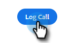

# Razones de la llamada {#call-reasons}

Permita que sus equipos de ventas seleccionen motivos de llamada al realizar llamadas para que su equipo pueda comprender por qué se realizan las llamadas.

>[!NOTE]
>
>**Se requieren permisos de administrador.**

## Habilitar motivos de llamada {#enable-call-reasons}

1. Haga clic en el icono del engranaje y seleccione **Configuración**.

   

1. En Configuración de administración , seleccione **Marcador**.

   

1. Select **Habilitar motivos de llamada**.

   

1. Elija el requisito de motivo de llamada que desee.

   

## Motivo de la llamada de creación {#create-call}

1. Haga clic en el icono del engranaje y seleccione **Configuración**.

   

1. En Configuración de administración , seleccione **Marcador**.

   

1. Haga clic en **Administrar motivos de llamada**.

   

1. Introduzca el nombre del motivo de la llamada deseado en el campo de texto y haga clic en **Agregar**.

   

## Seleccionar un motivo de llamada {#select-a-call-reason}

Los motivos de una vez que se ha habilitado la llamada Los usuarios pueden seleccionar una mientras realizan una llamada.

1. Haga clic en el botón de llamada para iniciar el marcador.

   

1. Introduzca la información de llamada en el marcador y haga clic en **La llamada**.

   

1. Seleccione el motivo de la llamada que mejor describe la llamada.

   

1. Finalice la llamada .

   

1. Registre la llamada .

   

>[!MORELIKETHIS]
>
>* [Razones de la llamada de registro y resultados de la llamada a Salesforce](/help/marketo/product-docs/marketo-sales-connect/phone/log-call-reasons-and-call-outcomes-to-salesforce.md)
>* [Llamar a resultados](/help/marketo/product-docs/marketo-sales-connect/phone/call-outcomes.md)

