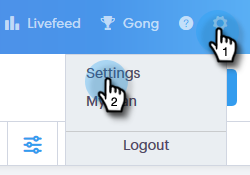

# Habilitar la grabación de llamadas {#enable-call-recording}

Como administrador, puede habilitar la grabación de llamadas para sus llamadas de [!DNL Sales Connect]. Grabar las llamadas de su equipo puede ser una buena manera de entrenar a sus representantes de ventas en las mejores prácticas de llamadas.

1. Haga clic en el icono Configuración y seleccione **[!UICONTROL Configuración]**.

   

1. En [!UICONTROL Configuración de administración], haga clic en **[!UICONTROL General]**.

   

1. Desplácese hacia abajo hasta [!DNL Sales Connect] Configuración del teléfono y seleccione la opción **[!UICONTROL Habilitar grabación de llamadas]**.

   

1. Si deseas que tus vendedores puedan habilitar o deshabilitar la grabación de llamadas, haz clic en **[!UICONTROL Grabación opcional para todos los integrantes del equipo]**. Si desea que todas las llamadas se registren automáticamente, haga clic en **[!UICONTROL Registrar todas las llamadas]**.

   

>[!MORELIKETHIS]
>
>[Configuración de consentimiento de dos partes](/help/marketo/product-docs/marketo-sales-connect/phone/two-party-consent-settings.md)
