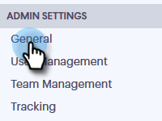

# Habilitar la grabación de llamadas {#enable-call-recording}

Como administrador, puede activar el registro de llamadas para sus llamadas de Sales Connect. El registro de las llamadas de su equipo puede ser una buena manera de instruir a sus representantes de ventas sobre las mejores prácticas de llamadas.

1. Haga clic en el icono Configuración y seleccione **Configuración**.

   

1. En Configuración de administración, haga clic en **General**.

   

1. Desplácese hacia abajo hasta Configuración de teléfono de Sales Connect y seleccione el **botón Activar grabación** de llamada.

   

1. Si desea que los vendedores puedan activar o desactivar la grabación de llamadas, haga clic en** Grabación opcional para todos los integrantes del equipo. **Si desea que todas las llamadas se registren automáticamente, haga clic** en Grabar todas las llamadas.**

   

>[!NOTE]
>
>**Artículos relacionados**
>
>[Configuración de consentimiento de dos partes](http://docs.marketo.com/x/dgC1Ag)

