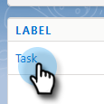

# Razones de la llamada de registro y resultados de la llamada a Salesforce {#log-call-reasons-and-call-outcomes-to-salesforce}

Si desea registrar los resultados de las llamadas y llamar a Salesforce por motivos de informes o visibilidad, puede crear un campo de actividad personalizado para cada uno. Cada campo debe utilizar un nombre de API específico (denominado &quot;Nombre de campo&quot; en Salesforce).

* Nombre del campo Resultados de la llamada: mktosales_call_result
* Nombre del campo Razones de la llamada: mktosales_call_reason

Para utilizar estos campos, primero debe crear el campo como campo de actividad personalizado. Para que los usuarios puedan verlo, deberá agregarlo al diseño de página del objeto de tarea.

## Salesforce Classic {#salesforce-classic}

### Crear campo de actividad personalizado en Salesforce Classic  {#create-custom-activity-field-in-salesforce-classic}

1. En Salesforce, haga clic en **Configuración**.

   

1. Escriba &quot;Actividades&quot; en el cuadro Búsqueda rápida.

   

1. Haga clic en **Campos personalizados de actividad**.

   

1. Haga clic en **Nuevo**.

   

1. Seleccione el tipo de datos &quot;Texto&quot; y haga clic en **Siguiente**.

   

1. Asigne al campo personalizado el nombre del campo tal como se ha definido anteriormente. La longitud del campo tiene un límite de 255 caracteres. Field Label será el campo visible para su equipo de ventas y puede personalizarse para satisfacer las necesidades de su equipo.

   

1. El resto de los ajustes son opcionales. Una vez completada la configuración, haga clic en **Siguiente**.

   

1. Seleccione la configuración de seguridad de nivel de campo que desee para este campo y haga clic en **Siguiente** (la imagen siguiente es solo un ejemplo).

   

   >[!NOTE]
   >
   >Asegúrese de que el campo personalizado sea visible para el perfil que utilizan los usuarios de Sales Connect, junto con cualquier otro lugar en el que desee que sea visible.

1. Seleccione a qué diseños de página desea añadir el campo y haga clic en **Guardar** (opcionalmente, puede hacer clic en **Guardar y nuevo** y repita el proceso para el campo Razón de la llamada ).

   

### Agregar campo de actividad personalizado al diseño de página de tarea en Salesforce Classic {#add-custom-activity-field-to-task-page-layout-in-salesforce-classic}

>[!NOTE]
>
>Solo tendrá que seguir estos pasos si no ha seleccionado el diseño de página deseado en el paso 9 anterior.

1. En Salesforce, haga clic en **Configuración**.

   

1. Escriba &quot;Tarea&quot; en el cuadro Búsqueda rápida.

   

1. Haga clic en **Diseños de páginas de tareas**.

   

1. Haga clic en **Editar** junto al diseño de la página de tareas a la que desea añadir este campo.

   

1. Arrastre y suelte el campo en la sección deseada del diseño de página Tarea .

   

1. Haga clic en **Guardar**.

   

## Salesforce Lightning {#salesforce-lightning}

### Crear campo de actividad personalizado en el relámpago de Salesforce {#create-custom-activity-field-in-salesforce-lightning}

1. En Salesforce, haga clic en el icono de engranaje en la parte superior derecha y seleccione **Configuración**.

   

1. Haga clic en **Administrador de objetos**.

   

1. Escriba &quot;Actividad&quot; en el cuadro Búsqueda rápida.

   

1. Haga clic en el **Actividad** etiqueta.

   

1. Haga clic en **Campos y relaciones**.

   

1. Haga clic en **Nuevo**.

   

### Agregar campo de actividad personalizado al diseño de página de tarea en el relámpago de Salesforce {#add-custom-activity-field-to-task-page-layout-in-salesforce-lightning}

1. En Salesforce, haga clic en el icono de engranaje en la parte superior derecha y seleccione **Configuración**.

   

1. Haga clic en **Administrador de objetos**.

   

1. Escriba &quot;Tarea&quot; en el cuadro Búsqueda rápida.

   

1. Haga clic en el **Tarea** etiqueta.

   

1. Haga clic en **Diseños de página**.

   

1. Haga clic en el diseño de página de la tarea al que desee agregar este campo.

   

1. Arrastre y suelte el campo en la sección deseada del diseño de página Tarea .

   

1. Haga clic en **Guardar**.

   

>[!MORELIKETHIS]
>
>[Instalar campos de evento de conexión de ventas en el historial de actividades](/help/marketo/product-docs/marketo-sales-connect/crm/salesforce-customization/install-sales-connect-event-fields-on-activity-history.md)
