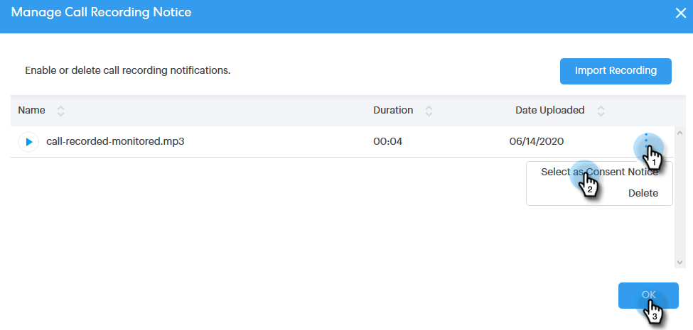

# Configuración de consentimiento de dos partes {#two-party-consent-settings}

Para garantizar el cumplimiento de las leyes de consentimiento de dos partes de EE.UU. al grabar llamadas, como administrador puede activar un mensaje pregrabado de su elección para que se reproduzca al principio de las llamadas cuando se grabe.

>[!PREREQUISITES]
>
>Antes de seguir los pasos que se describen a continuación, primero debe [habilitar la grabación de llamadas](/help/marketo/product-docs/marketo-sales-connect/phone/enable-call-recording.md).

1. Haga clic en el icono Configuración y seleccione **Configuración**.

   

1. En Configuración de administración, haga clic en **General**.

   

1. Desplácese hacia abajo hasta Configuración de teléfono de Sales Connect y haga clic en **Administrar aviso de grabación**.

   

1. Haga clic en **Importar grabación**.

   

   >[!NOTE]
   >
   >Solo se admiten archivos Wav y MP3. No se puede cargar un archivo de más de 30 segundos.

1. Seleccione el archivo de audio que desee en el disco duro.

   

1. Una vez completada la carga, seleccione los datos (tres puntos) en el administrador de archivos y haga clic en **Seleccionar como aviso de consentimiento**. Haga clic en **Aceptar** cuando termine.

   

1. Haga clic en el botón de alternancia para habilitar la reproducción del mensaje seleccionado al principio de las llamadas grabadas.

   
