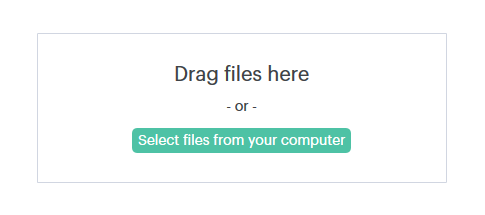

# Configuración del consentimiento entre dos partes {#two-party-consent-settings}

Para garantizar el cumplimiento de las leyes de consentimiento de dos partes de Estados Unidos al grabar llamadas, como administrador puede habilitar un mensaje pregrabado de su elección para que se reproduzca al principio de las llamadas cuando se grabe.

>[!PREREQUISITES]
>
>Antes de seguir los pasos siguientes, primero debe [habilitar la grabación de llamadas](/help/marketo/product-docs/marketo-sales-connect/phone/enable-call-recording.md).

1. Haga clic en el icono Configuración y seleccione **[!UICONTROL Configuración]**.

   

1. En [!UICONTROL Configuración de administración], haga clic en **[!UICONTROL General]**.

   

1. Desplácese hasta [!UICONTROL Configuración del teléfono de Sales Connect] y haga clic en **[!UICONTROL Administrar aviso de grabación]**.

   

1. Haga clic en **[!UICONTROL Importar grabación]**.

   

   >[!NOTE]
   >
   >Solo se admiten archivos Wav y MP3. No puede cargar un archivo de más de 30 segundos.

1. Seleccione el archivo de audio que desee en el disco duro.

   

1. Una vez completada la carga, seleccione los datos (tres puntos) en el administrador de archivos y haga clic en **[!UICONTROL Seleccionar como aviso de consentimiento]**. Haga clic en **[!UICONTROL Aceptar]** cuando termine.

   

1. Haga clic en el botón de alternancia para permitir que el mensaje seleccionado se reproduzca al principio de las llamadas grabadas.

   
