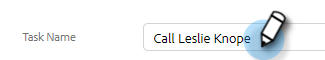
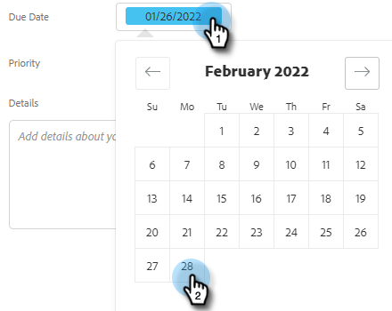

# Crear y asignar tareas de recordatorio {#create-and-assign-reminder-tasks}

Las tareas de recordatorio son una buena manera de mantenerse al tanto de la participación del cliente y del cliente potencial. Para crear una tarea, siga estos pasos.

1. Haga clic en **[!UICONTROL Centro de comandos]**.

   

1. Tareas se abre de forma predeterminada. Haga clic en **[!UICONTROL Agregar tarea]**.

   

1. Seleccione el tipo de tarea entre [!UICONTROL Correo electrónico], [!UICONTROL Llamada], [!UICONTROL EnCorreo] o Tarea [!UICONTROL Personalizada].

   

1. Asigne un nombre a la tarea.

   

1. Elija si desea conservar la tarea asignada a usted mismo o seleccione a otro usuario al que asignar la tarea.

   

1. Agregue la persona con la que está realizando el seguimiento con esta tarea de recordatorio.

   

1. Seleccione la fecha de vencimiento de la tarea.

   

1. Seleccione la prioridad de la tarea.

   

1. Agregue cualquier detalle sobre la tarea que desee que esté disponible al completar la tarea, como notas de llamada, una plantilla de mensaje InMail o incluso notas sobre la persona. Haga clic en **[!UICONTROL Crear]** cuando haya terminado.

   
