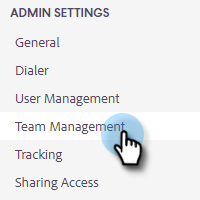
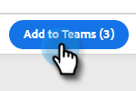

# Creación de un equipo {#creating-a-team}

La creación de un equipo permite reunir un grupo de usuarios con los que se puede compartir contenido y por los que se pueden filtrar informes.

## Crear un equipo {#create-a-team}

1. En la [aplicación web](https://toutapp.com/login), haga clic en el icono de engranaje y seleccione **[!UICONTROL Configuración]**.

   

1. En [!UICONTROL Configuración de administración], seleccione **[!UICONTROL Administración de equipo]**.

   

1. Junto a [!UICONTROL Equipos], haga clic en el icono **+**.

   

1. Escriba un nombre de equipo y haga clic en **[!UICONTROL Crear]**.

   

>[!NOTE]
>
>Ahora puede compartir plantillas, campañas y grupos con ese equipo.

## Agregar personas a un equipo {#add-people-to-a-team}

1. Aún en [!UICONTROL Administración de equipo], seleccione **[!UICONTROL Todos los miembros]**.

   

1. Busque los usuarios que desea agregar a su equipo y marque su casilla de verificación.

   

1. Haga clic en **[!UICONTROL Agregar a equipos]**.

   

1. Haga clic en el menú desplegable y seleccione el equipo que desee.

   

1. Haga clic en **[!UICONTROL Agregar]** cuando haya terminado.

   
