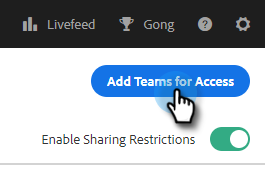
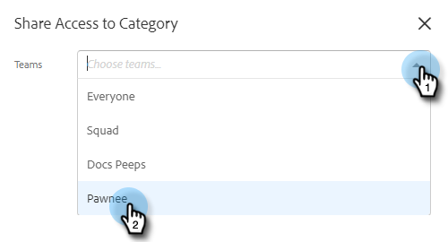

# Configuración de uso compartido {#sharing-settings}

Administre mejor las plantillas restringiendo lo que los usuarios pueden compartir y con qué categorías.

Cuando se crea la cuenta de Conexión de ventas por primera vez, la opción Configuración de uso compartido está activada. Esto da a los administradores de cuentas la oportunidad de crear y organizar las categorías de plantillas antes de abrir las puertas y permitir a los usuarios compartir contenido en las categorías de equipos.

Cuando la opción Compartir configuración está activada, solo los administradores podrán compartir en categorías a menos que se proporcionen privilegios de compartir a un equipo o a todos. Con Configuración de uso compartido desactivada, no hay restricciones y todos los usuarios pueden compartir en cualquier categoría de plantilla.

## Configurar la configuración de uso compartido {#configure-your-sharing-settings}

1. En el [aplicación web](https://toutapp.com/login), haga clic en el icono del engranaje y seleccione **Configuración**.

   

1. En Configuración de administración, seleccione **Acceso compartido**.

   

1. Asegúrese de **Configuración de uso compartido** está activada. Esto significa que, de forma predeterminada, solo los administradores podrán compartir plantillas en sus categorías de plantillas.

   

1. Seleccione la categoría de plantilla que desee configurar.

   

1. Haga clic en **Agregar equipos para acceso**.

   

1. Seleccione los equipos que desee agregar.

   

   >[!NOTE]
   >
   >Si no ve ningún equipo, deberá ir a Administración de equipos y crear un equipo de usuarios.

1. Haga clic en **Agregar equipos para acceso** para guardar.

   

1. Ahora que su equipo se ha agregado, puede seleccionar permitir que solo los administradores del equipo compartan o que todos los usuarios de ese equipo. En este ejemplo, estamos dando acceso compartido a todos los usuarios del equipo de SDR.

   
