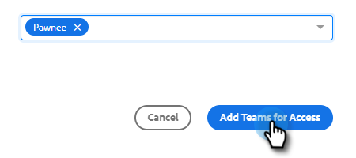

# Configuración para compartir {#sharing-settings}

Administre mejor sus plantillas restringiendo lo que los usuarios pueden compartir y con qué categorías.

Cuando se crea la cuenta de acciones de información de ventas por primera vez, se activa la opción para compartir configuración. Esto ofrece a los administradores de su cuenta la oportunidad de crear y organizar las categorías de plantilla antes de abrir las puertas y permitir a los usuarios compartir contenido en las categorías de equipo.

Cuando Configuración de uso compartido está habilitada, solo los administradores podrán compartir en categorías a menos que se proporcionen privilegios de uso compartido a un equipo o a todos. Con Configuración de uso compartido deshabilitada, no hay restricciones y todos los usuarios pueden compartir en cualquier categoría de plantilla.

## Configurar la configuración de uso compartido {#configure-your-sharing-settings}

1. En la [aplicación web](https://toutapp.com/login), haga clic en el icono de engranaje y seleccione **Configuración**.

   

1. En Configuración de administración, seleccione **Acceso compartido**.

   

1. Asegúrese de que **Configuración de uso compartido** esté habilitada. Esto significa que, de forma predeterminada, solo los administradores podrán compartir plantillas en las categorías de plantillas.

   

1. Seleccione la categoría de plantilla que desee configurar.

   

1. Haga clic en **Agregar equipos para obtener acceso**.

   

1. Seleccione los equipos que desee añadir.

   

   >[!NOTE]
   >
   >Si no ve ningún equipo, tendrá que ir a Administración de equipos y crear un equipo de usuarios.

1. Haga clic en **Agregar equipos para obtener acceso** para guardar.

   

1. Ahora que se ha añadido su equipo, puede seleccionar permitir que solo los administradores de equipo compartan información sobre todos los usuarios de ese equipo. En este ejemplo damos acceso compartido a todos los usuarios del equipo de SDR.

   
