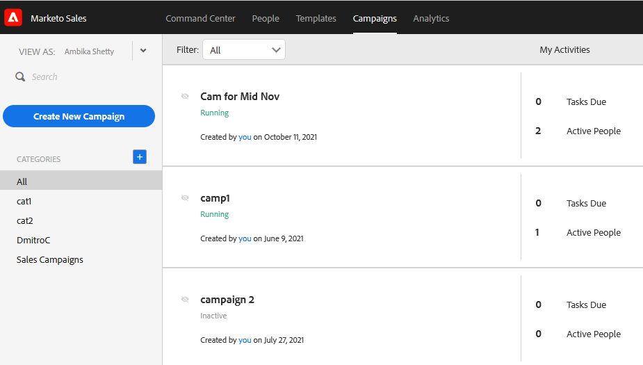

# Detalles de acceso del usuario {#user-access-details}

¿A qué tienen acceso los administradores y los no administradores?

## Permisos de usuario de administración {#admin-user-permissions}

Los administradores pueden [ver todas las plantillas](/help/marketo/product-docs/marketo-sales-connect/templates/view-template-list-as-another-user.md).

Los administradores pueden [ver todas las campañas](/help/marketo/product-docs/marketo-sales-connect/campaigns/view-campaigns-list-as-another-user.md).

Los administradores pueden ver toda la actividad de correo electrónico.

Los administradores pueden ver a todas las personas de una campaña en curso.

Los administradores pueden ver los usuarios, las campañas y las categorías de campaña con la lista desplegable Ver como.

Los administradores pueden detener campañas en nombre de los usuarios.

## Permisos de usuario no administrador {#non-admin-user-permissions}

* Analytics:

   * Los usuarios pueden ver análisis de equipo
   * Los usuarios pueden explorar en profundidad únicamente los equipos a los que pertenecen
   * Los usuarios pueden ver sus propios análisis

* Página Personas:

   * Los usuarios pueden compartir grupos con todos
   * Los usuarios pueden compartir grupos únicamente con los equipos a los que pertenecen
   * Los usuarios tendrán visibilidad de todas las personas de la base de datos de acciones
   * Cuando se elimina un usuario, sus contactos compartidos transfieren la propiedad al administrador maestro que eliminó el usuario

* Página Administración del equipo:

   * No se puede ver

* Página Plantillas:

   * Los usuarios pueden compartir plantillas con todos
   * Los usuarios pueden compartir plantillas en categorías que los administradores les permiten
   * Cuando se elimina a un usuario de un equipo, sus plantillas dejan de compartirse con ese equipo
   * Cuando se elimina un usuario de un equipo, sus plantillas transfieren la propiedad al administrador maestro que eliminó el usuario
