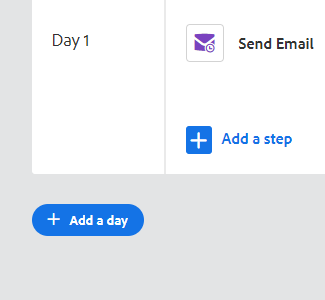

# Crear una campaña de ventas {#create-a-sales-campaign}

Las campañas de ventas son una serie de pasos multicanal que incluyen: correos electrónicos, llamadas telefónicas, InMail y tareas personalizadas. Permiten optimizar las comunicaciones con sus clientes potenciales y existentes.

Con las campañas de ventas puede:

* **Organizar**: Optimice todas sus actividades de divulgación en un solo lugar para una ejecución eficiente.
* **Escala**: Programe todos sus esfuerzos de divulgación para que pueda escalar sus esfuerzos, minimizar el trabajo manual y personalizar todo lo que necesite.
* **Medida**: Rastree el éxito de todos sus correos electrónicos y tareas en un lugar mientras los inicia automáticamente en Salesforce. Al saber lo que resuena y conduce a resultados, puede probar y mejorar sus resultados de forma consistente.

Entonces, ¿cómo se configura una campaña de ventas?

1. Haga clic en el **Campañas** pestaña .

   

1. Seleccione una categoría y haga clic en el botón **Crear nueva campaña** botón.

   

   >[!NOTE]
   >
   >Cree una nueva categoría haciendo clic en la **+** junto a **Categorías**.

1. Se seleccionará la categoría elegida. Si cambia de opinión, haga clic en la lista desplegable y seleccione otra. Cuando haya terminado, haga clic en **Continuar**.

   

1. Haga clic en **Adición de un paso**.

   

1. Elija entre: Correo electrónico, Llamada, InMail o Tarea personalizada. En este ejemplo elegimos Correo electrónico.

   

1. Cuando [finalizado con su correo electrónico](/help/marketo/product-docs/marketo-sales-insight/actions/campaigns/sales-campaign-step-types-and-reminder-tasks.md#email){target=&quot;_blank&quot;}{target=&quot;_blank&quot;}, haga clic en **Agregar**.

   

1. Después de crear su primer día y paso, se activa el botón &quot;Agregar un día&quot; y puede agregar tantos días y pasos como requiera su proceso de ventas.

   

   >[!NOTE]
   >
   >&quot;Días&quot; no es el número de días entre acciones, sino el día dentro de la secuencia. Por ejemplo, si la campaña de ventas va a durar 7 días, al introducir &quot;3&quot;, la acción se emitirá el día 3 de 7. **not** 3 días después.

1. Asegúrese de personalizar las opciones de programación y respuesta, como saltarse los fines de semana (algo impresionante), visitando el **Ficha Configuración** para su campaña de ventas.

   

¡Ahora es el momento de empezar a agregar gente!

>[!MORELIKETHIS]
>
>* [Opciones de envío de campañas de ventas para pasos de correo electrónico](/help/marketo/product-docs/marketo-sales-insight/actions/campaigns/sales-campaign-send-options-for-email-steps.md){target=&quot;_blank&quot;}
>* [Tipos de pasos de campañas de ventas y tareas de recordatorio](/help/marketo/product-docs/marketo-sales-insight/actions/campaigns/sales-campaign-step-types-and-reminder-tasks.md){target=&quot;_blank&quot;}
>* [Configuración de campañas de ventas](/help/marketo/product-docs/marketo-sales-insight/actions/campaigns/sales-campaign-settings.md){target=&quot;_blank&quot;}

