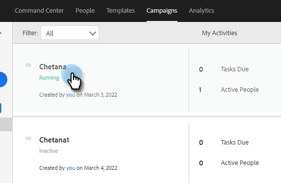

# Configuración de campañas de ventas {#sales-campaign-settings}

La sección de configuración de campañas de ventas le permite configurar una campaña de ventas específica para que funcione de la mejor manera posible según los casos de uso de su equipo para esa campaña.

## Omitir fines de semana {#skip-weekends}

Active Omitir fines de semana para que cualquier paso que se haya interrumpido en un día de fin de semana (sábado o domingo) se mueva al lunes.

>[!NOTE]
>
>Con la opción Omitir fines de semana habilitada, los correos electrónicos se programarán en función de una semana de 5 días. Es decir, cuando se programa un paso, los fines de semana se ignorarán como días.

1. Haga clic en **Campañas**.

   

1. Elija la campaña que desee.

   

1. Haga clic en el **Configuración** pestaña .

   

1. Seleccione el **Omitir fines de semana** casilla de verificación.

   

## Eliminar al rebote {#remove-on-bounce}

Si utiliza la conexión de correo electrónico, detectaremos devoluciones en función del mensaje de rechazo enviado a la bandeja de entrada del usuario. Además, se pueden eliminar personas de las campañas cuando se detecta una devolución.

1. Haga clic en **Campañas**.

   

1. Elija la campaña que desee.

   

1. Haga clic en el **Configuración** pestaña .

   

1. Seleccione el **Eliminar al rebote** casilla de verificación.

   

## Si se produce una respuesta {#if-a-reply-occurs}

Si tiene habilitado el seguimiento de respuestas para Gmail o Exchange, podemos finalizar automáticamente su campaña de ventas si un destinatario responde a su correo electrónico.

1. Haga clic en **Campañas**.

   

1. Elija la campaña que desee.

   

1. Haga clic en el **Configuración** pestaña .

   

1. En **Si se produce una respuesta**, realice las selecciones que desee.

   

>[!MORELIKETHIS]
>
>* [Crear una campaña de ventas](/help/marketo/product-docs/marketo-sales-insight/actions/campaigns/create-a-sales-campaign.md){target=&quot;_blank&quot;}
>* [Explicación de las opciones de envío de campañas de ventas para los pasos de correo electrónico](/help/marketo/product-docs/marketo-sales-insight/actions/campaigns/understanding-sales-campaign-send-options-for-email-steps.md){target=&quot;_blank&quot;}
>* [Tipos de pasos de campañas de ventas y tareas de recordatorio](/help/marketo/product-docs/marketo-sales-insight/actions/campaigns/sales-campaign-step-types-and-reminder-tasks.md){target=&quot;_blank&quot;}

