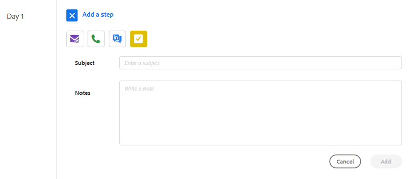

# Tipos de pasos de campañas de ventas y tareas de recordatorio {#sales-campaign-step-types-and-reminder-tasks}

## Tipos de pasos de campañas de ventas {#sales-campaign-step-types}

Al añadir un paso a la campaña de ventas, tiene cuatro opciones.

### Correo electrónico {#email}

Componga un correo electrónico nuevo o utilice una plantilla preexistente.

| **[!UICONTROL Usar una plantilla]** | Seleccione una de las plantillas preexistentes |
|---|---|
| **[!UICONTROL Guardar como plantilla]** | Guarde el correo electrónico que acaba de crear como una plantilla nueva |
| **Agregar contenido** | Cargue un archivo en nuestro servidor y reciba una URL (que apunte al contenido) de la que se pueda realizar un seguimiento en su correo electrónico |
| **Adjuntar archivos** | Adjuntar un archivo del equipo al correo electrónico (límite de tamaño de 23 MB) |

>[!TIP]
>
>Conozca los detalles sobre sus [opciones de envío](/help/marketo/product-docs/marketo-sales-insight/actions/campaigns/understanding-sales-campaign-send-options-for-email-steps.md){target="_blank"}.

### Llamar {#call}

Configure un recordatorio para realizar el seguimiento con un contacto a través del teléfono. También puede guardar notas para usarlas como un tema de conversación durante la llamada.

### InMail {#inmail}

El seguimiento de varios canales es una buena manera de conectarse con posibles clientes. Con las tareas de InMail, puede configurar un recordatorio para ponerse en contacto con a través de LinkedIn.

### Tarea personalizada {#custom-task}

Utilice tareas personalizadas cuando las opciones anteriores no sean aplicables. Por ejemplo, puede invitar a un compañero a realizar un seguimiento con un posible cliente por correo electrónico.

## Uso de tareas de recordatorio en campañas de ventas {#using-reminder-tasks-in-sales-campaigns}

Las tareas son una herramienta potente al enviar una campaña de ventas a un contacto, especialmente si el proceso de ventas es multicanal o táctil.

La tarea para enviar un correo electrónico y la tarea para llamar a un contacto son los usos más comunes de las tareas en las campañas de ventas.

También puede hacer que una &quot;Tarea a Inmail&quot; sea un contacto en LinkedIn si eso es parte de su flujo de trabajo. También puede hacer una tarea personalizada para recordarle que los invite a una hora feliz, pregunte sobre su evento de caridad o haga el check-in después del juego 5, etc.

>[!NOTE]
>
>Lo más importante de las Tareas en Campañas de ventas es que debe completar la tarea para almacenar en déclencheur el siguiente paso.

>[!MORELIKETHIS]
>
>[Crear una campaña de ventas](/help/marketo/product-docs/marketo-sales-insight/actions/campaigns/create-a-sales-campaign.md){target="_blank"}
