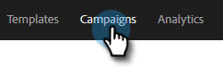

# Ver la lista de campañas como otro usuario {#view-campaigns-list-as-another-user}

Como administrador, puede ver las campañas como cualquier usuario.

>[!NOTE]
>
>**Se requieren permisos de administrador**

1. En la aplicación web, haga clic en **Campañas**.

   

1. Haga clic en el **Ver como** y seleccione el usuario que desee.

   

1. Ahora está viendo las campañas como el usuario seleccionado.

   

   >[!NOTE]
   >
   >También puede utilizar filtros o la función de búsqueda, junto con Ver como, para ver qué es lo que más le interesa.
