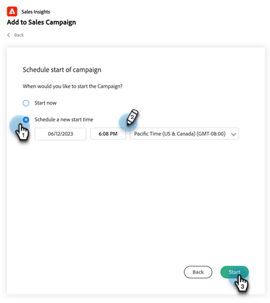
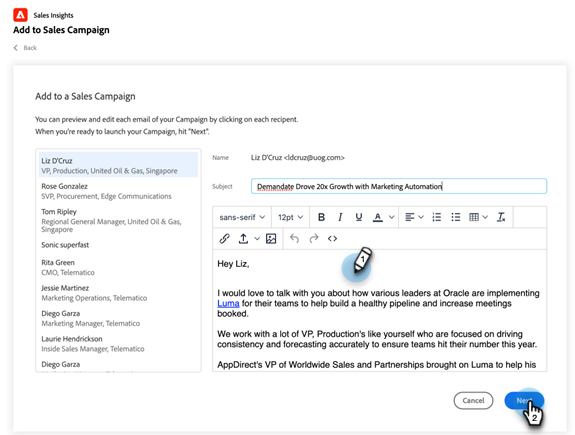

# Uso de la campaña de adición masiva a ventas en Salesforce {#using-bulk-add-to-sales-campaign-in-salesforce}

Aprenda a añadir elementos de forma masiva a la campaña de ventas en Salesforce para escalar la comunicación saliente mediante acciones de ventas.

>[!NOTE]
>
>Salesforce aplica un límite de 200 registros que se pueden seleccionar a la vez.

>[!PREREQUISITES]
>
>Asegúrese de que ha instalado el [último paquete de perspectivas de ventas](/help/marketo/product-docs/marketo-sales-insight/msi-for-salesforce/upgrading/upgrading-your-msi-package.md){target="_blank"} to your Salesforce instance and have configured the [Action buttons](/help/marketo/product-docs/marketo-sales-insight/actions/crm/salesforce-package-configuration/add-action-buttons-to-salesforce-list-view.md){target="_blank"} en las vistas de contactos y listas de posibles clientes de Salesforce.

## Añadir masivamente a la campaña de ventas en Salesforce Lightning {#bulk-add-to-sales-campaign-in-salesforce-lightning}

1. En Salesforce, vaya a la página de inicio de posibles clientes/contactos haciendo clic en **Posibles clientes/contactos** pestaña.

   

1. En el **Ver** , seleccione la vista que desee de los posibles clientes/contactos que desee enviar por correo electrónico.

   >[!TIP]
   >
   >Puede crear una nueva vista haciendo clic en el icono de engranaje de la derecha y seleccionando **Nuevo**. Una vez que le haya dado a la vista un nuevo nombre y lo haya guardado, puede hacer clic en el icono de filtro de la derecha para ayudar a filtrar hasta el conjunto deseado de posibles clientes/contactos que desee enviar por correo electrónico.

1. Seleccione la lista de contactos o posibles clientes que desee y haga clic en **Añadir a la campaña de ventas** botón.

   

1. Se le dirigirá al modal Actions Sales Campaign, con los destinatarios seleccionados añadidos.

1. Realice los cambios necesarios para eliminar personas o grupos y haga clic en **Siguiente**.

   

1. Seleccione la categoría de campaña de ventas que desee utilizar en la lista desplegable Categorías.

1. Seleccione la campaña de ventas a la que desee añadir a las personas seleccionadas y haga clic en **Siguiente**.

   

1. Puede ver diferentes opciones en función del primer paso de la campaña. Si el primer paso es un correo electrónico, tiene la opción de editar el correo electrónico para cada destinatario, como se muestra a continuación. Una vez hecho esto, haga clic en **Siguiente**.

   

1. De nuevo, si el primer paso es un correo electrónico y lo ha configurado para permitirle seleccionar cuándo se inicia la campaña, tendrá la opción de **Comenzar ahora** o **Programar nueva hora de inicio**. Una vez completado este proceso, haga clic en **Inicio**.

   

Después de hacer clic en Inicio, verá una pantalla de confirmación que le permite saber cuántas personas se han agregado.

## Añadir de forma masiva a la campaña de ventas en Salesforce Classic {#bulk-add-to-sales-campaign-in-salesforce-classic}

1. En Salesforce, haga clic en **Posibles clientes/contactos** pestaña.

1. En la lista desplegable Ver, seleccione la vista que desee de los posibles clientes o contactos que desee enviar por correo electrónico y haga clic en **Ir**.

   

   >[!TIP]
   >
   >Puede crear una nueva vista haciendo clic en Create New View y configurando los filtros disponibles para reducir la lista de destinatarios que enviará por correo electrónico.

1. Seleccione el posible cliente o la lista de contactos que desee y haga clic en **Añadir a la campaña de ventas** botón.

1. Se le dirigirá al modal de campañas de ventas de acciones con las personas seleccionadas añadidas.

1. Realice los cambios necesarios para eliminar personas o grupos y haga clic en **Siguiente**.

   

1. Seleccione la categoría de campaña de ventas que desee utilizar en **Categorías** menú desplegable.

1. Seleccione la campaña de ventas a la que desee añadir a las personas seleccionadas y haga clic en **Siguiente**.

   

1. Puede ver diferentes opciones en función del primer paso de la campaña. Si el primer paso es un correo electrónico, tiene la opción de editar el correo electrónico para cada destinatario, como se muestra a continuación. Una vez hecho esto, haga clic en **Siguiente**.

   

1. De nuevo, si el primer paso es un correo electrónico y lo ha configurado para permitirle seleccionar cuándo se inicia la campaña, tendrá la opción de **Comenzar ahora** o **Programar nueva hora de inicio**. Una vez completado este proceso, haga clic en **Inicio**.

   

Después de hacer clic en Inicio, verá una pantalla de confirmación que le permite saber cuántas personas se han agregado.

