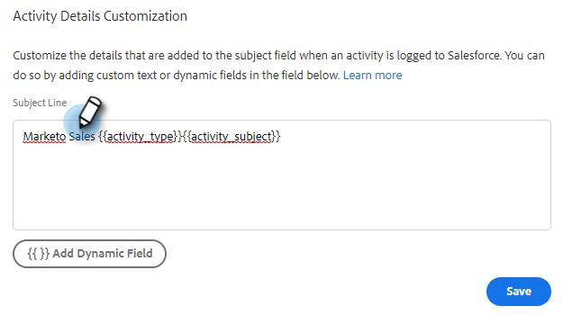

# Configurar la personalización de detalles de actividad [!DNL Salesforce] {#configure-salesforce-activity-detail-customization}

>[!PREREQUISITES]
>
>* Las acciones de Salesforce y Sales Insight [deben estar conectadas](/help/marketo/product-docs/marketo-sales-insight/actions/crm/salesforce-integration/connect-your-sales-insight-actions-account-to-salesforce.md)
>* El registro de la actividad de correo electrónico mediante la API [debe estar habilitado](/help/marketo/product-docs/marketo-sales-insight/actions/crm/salesforce-integration/sync-sales-activities-to-salesforce.md)

La personalización de los detalles de actividad permite a los administradores configurar la información que se registrará en el campo [!DNL Salesforce] Tarea - Asunto, cuando se sincronice una tarea de actividad/recordatorio [!DNL Sales Insight Actions] con [!DNL Salesforce].

>[!NOTE]
>
>* Las actualizaciones realizadas en el campo de asunto de [!DNL Sales Insight Actions] de una tarea de recordatorio se reflejarán en el campo de asunto de la tarea [!DNL Salesforce] correspondiente, si está utilizando el campo dinámico `{{activity_subject}}` en la personalización de los detalles de actividad.
>* No se admiten saltos de línea al registrar información en el campo de asunto [!DNL Salesforce]. Los saltos de línea del editor de personalización de detalles de actividad se eliminarán cuando se actualice el asunto de una tarea de ventas.

<table>
 <tr>
  <td><strong>1</td>
  <td>Tarea de recordatorio de correo</td>
 </tr>
 <tr>
  <td><strong>2</td>
  <td>Actividad de email</td>
 </tr>
 <tr>
  <td><strong>3</td>
  <td>Actividad de llamada</td>
 </tr>
</table>

La función se puede utilizar para desbloquear las siguientes ventajas:

* Al personalizar qué información está visible en el campo de asunto, los detalles de la actividad se pueden analizar fácilmente para buscar ventas en Salesforce.
* Los administradores pueden etiquetar el campo de asunto con un identificador único como &quot;Mkto_sales&quot; para que las actividades de Sales Insight Actions se puedan identificar y diferenciar fácilmente de otras actividades de correo electrónico, actividades de llamada y tareas.
* Reduzca la necesidad de campos de actividad personalizados. Salesforce aplica límites en el número de campos de actividad personalizados, lo que puede restringir qué datos están disponibles para utilizarse en los informes. Si utiliza campos dinámicos de actividad para agregar datos clave a la línea de asunto, puede reducir el número de campos de actividad personalizados que necesita crear en la instancia de Salesforce.
* El campo de asunto de las actividades y tareas seguirá un patrón coherente definido por el administrador de acciones de Sales Insight.

>[!NOTE]
>
>Si está registrando las respuestas de correo electrónico como actividades de [!DNL Salesforce], no se usará la configuración de personalización de detalles de actividad de [!DNL Salesforce]. En su lugar, registrarán como &quot;Respuesta: Asunto del correo electrónico&quot;.

## Campos dinámicos de actividad admitidos {#activity-dynamic-fields-supported}

Actividad Los campos dinámicos hacen referencia a información sobre sus actividades de ventas para rellenar datos. Hoy en día, se pueden usar con la personalización de los detalles de actividad de [!DNL Salesforce].

>[!NOTE]
>
>Si no hay ningún valor para rellenar el campo dinámico para una actividad o tarea específica, no rellenará ningún dato para ese campo dinámico cuando se actualice el campo Tarea - Asunto de Salesforce.

<table>
 <tr>
  <th>Campo</th>
  <th>Descripción</th>
 </tr>
 <tr>
  <td>{{activity_type}}</td>
  <td>Rellenará el tipo de tarea como Correo electrónico, Llamada, InMail o Personalizada.</td>
 </tr>
 <tr>
  <td>{{activity_subject}}</td>
  <td>
Rellenará el asunto de la tarea.

      
En el caso de un correo electrónico, rellena la línea de asunto del mismo.

      
En el caso de la llamada, inMail o personalizada, rellena un valor si ha habido una tarea de recordatorio creada con un valor en el campo de nombre/asunto de la tarea.
</td>
 </tr>
 <tr>
  <td>{{sales_campaign_name}}</td>
  <td>Si la actividad se inició a partir de una campaña de ventas, se rellenará el nombre de la campaña de ventas.</td>
 </tr>
 <tr>
  <td>{{sales_campaign_day}}</td>
  <td>Si la actividad se inició a partir de una campaña de ventas, se rellenará el número de día de campaña de ventas en el que se produjo esta actividad.</td>
 </tr>
 <tr>
  <td>{{sales_campaign_step}}</td>
  <td>Si la actividad se inició a partir de una campaña de ventas, se rellenará el número de paso dentro del día de la campaña de ventas en el que se produjo esta actividad.</td>
 </tr>
 <tr>
  <td>{{call_outcome}}</td>
  <td>Si la actividad es una llamada y se selecciona un resultado de llamada, se rellenará el valor del resultado de la llamada.</td>
 </tr>
 <tr>
  <td>{{call_reason}}</td>
  <td>Si la actividad es una llamada y se selecciona un motivo de llamada, se rellenará el valor del motivo de la llamada.</td>
 </tr>
</table>

## Configurando la personalización de detalles de actividad [!DNL Salesforce] {#configuring-salesforce-activity-detail-customization}

>[!NOTE]
>
>Se requieren **permisos de administración.**

Al configurar los detalles de la actividad, tenga en cuenta qué datos serían los más relevantes para las ventas al revisar el historial de tareas en [!DNL Salesforce].

1. Haga clic en el icono del engranaje y seleccione **[!UICONTROL Configuración]**.

   

1. Haga clic en **[!UICONTROL Salesforce]**.

   

1. Haga clic en **[!UICONTROL Configuración de sincronización]**.

   

1. En el editor de personalización de detalles de actividad, añada el texto libre que desee. El texto que agregue no es dinámico y permanecerá sin cambios para el campo de asunto de todas las tareas sincronizadas con [!DNL Salesforce].

   

   >[!TIP]
   >
   >Aunque no es obligatorio, ajustar el texto agregado entre corchetes puede facilitar a algunas personas la distinción entre los datos cuando se rellenan en un campo de asunto de [!DNL Salesforce]. Ejemplo: `[Sales Insight Actions] - {{Activity_type}}`

1. Agregue cualquier campo dinámico adicional que desee haciendo clic en el botón **[!UICONTROL Agregar campo dinámico]**.

   

1. Seleccione los campos dinámicos que desee.

   

1. Haga clic en **[!UICONTROL Guardar]**.

   

>[!NOTE]
>
>[!DNL Salesforce] impone un límite de 255 caracteres. Si los detalles de la actividad superan ese límite, se truncará para garantizar que la información se almacene en el campo de asunto [!DNL Salesforce].

>[!MORELIKETHIS]
>
>* [Sincronizar actividades de ventas con Salesforce](/help/marketo/product-docs/marketo-sales-insight/actions/crm/salesforce-integration/sync-sales-activities-to-salesforce.md)
>* [Sincronización de tareas de recordatorio con Salesforce](/help/marketo/product-docs/marketo-sales-insight/actions/tasks/reminder-task-sync-with-salesforce.md)
